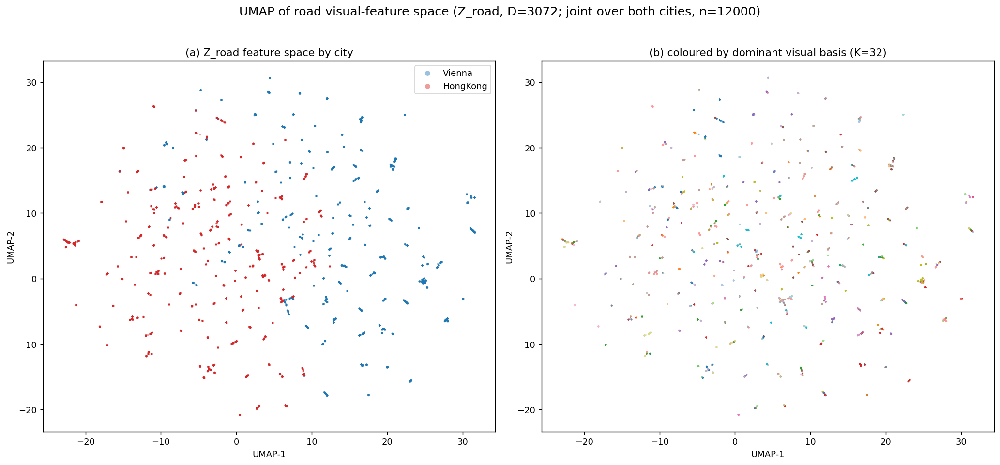

# Urban Visual Gene — 道路型最小景观单元（MRLU）

基于街景视觉特征，将城市路网自动切分为**视觉同质的最小道路景观单元**（Minimum Road-based Landscape Unit, MRLU）。

## 方法概览

```
Y = Enc(I)                 街景图像 → 4 方向 DINOv2 特征 concat (D=3072, L2 归一化)
Z_road = P_Groad(Y)        点特征经距离衰减聚合到路网节点（多路段非归一化加权）
Z_road ≈ A · X             稀疏自编码器学习视觉基 X (K×D) 与激活 A (M×K, ≥0)
U = R(A, G_road)           相邻节点激活余弦距离超阈值处断边 → 连通分量 = MRLU
```

完整 7 阶段：Stage1 特征提取 → Stage2 地图匹配 → Stage3 Z_road 上下文 → Stage4 稀疏基学习 → Stage5 激活推断 → Stage6 单元提取 →（Stage7 baseline）。

## 目录结构

```
scripts/        各阶段实现（均可 import，也支持 CLI）
  stage1_extract_pano_features.py    4 方向 DINOv2 特征
  stage2_map_match_road.py           UTM 地图匹配 + 路网图
  stage3_build_road_context_features.py
  stage4_train_road_basis_model.py   稀疏自编码器
  stage5_infer_road_basis_activation.py
  stage6_extract_road_units.py       MRLU 提取
  road_graph_utils.py / road_basis_model.py / io_utils.py
  _env.py                            线程池锁定（每个 runner 最先导入）
  cities.py                          城市数据加载（torch-free）
  run_stage1.py … run_stage6.py      各 stage 的隔离进程入口
  copy_data.py                       从 NAS 复制数据到本地 ./data
  plot_results.py / plot_pca_maps.py 出图
tests/          48 个合成数据单元测试（pytest，CPU，无需真实数据/GPU）
run_experiment.py    端到端编排器（纯子进程，避免 OpenMP 冲突崩溃）
outputs/        EXPERIMENT_REPORT.md + figures/ + 统计（大产物已 gitignore）
```

## 运行

```bash
# 依赖
pip install pytest numpy pandas scipy networkx geopandas shapely torch matplotlib

# 测试
pytest tests/ -q

# 实验（读本地 ./data，需先用 scripts/copy_data.py 准备数据）
python run_experiment.py --city both --max-panos 500 --K 32 --epochs 50
# 复用已提取特征 / 已建路网图：
python run_experiment.py --city Vienna --max-panos 500 --skip-stage1 --skip-stage2
```

### 进程隔离架构（避免崩溃）

PyTorch 用 Intel OpenMP/MKL（`libiomp5`），numpy/scipy/geopandas 用 GNU OpenMP
（`libgomp`）。两套线程库在**同一进程**会冲突，导致随机 native segfault
（详见 `crash_report_20260613.md`）。因此 `run_experiment.py` 是一个**纯子进程编排器**
（自身不导入任何重库），每个 stage 在独立进程运行：

| Stage | runner | 栈 |
|---|---|---|
| 1 特征提取 | `scripts/run_stage1.py` | torch |
| 2 地图匹配+路网图 | `scripts/run_stage2.py` | geopandas/scipy |
| 3 Z_road | `scripts/run_stage3.py` | scipy |
| 4-5 基学习+激活 | `scripts/run_stage45.py` | torch |
| 6 单元提取 | `scripts/run_stage6.py` | networkx/scipy |

`scripts/_env.py` 在每个 runner 最先导入，将所有 BLAS/OpenMP 线程池锁为 1。
**切勿在同一进程同时 `import torch` 与做 scipy/geopandas 重运算。**

## 实验结果（每城 500 抽样点）

> 配置：4 方向 DINOv2-ViT-B/14 concat（D=3072）；稀疏自编码器 K=32、hidden=512、epochs=50、`lambda_sparse=5e-3`、`lambda_spatial=1e-3`、`lambda_div=1e-3`；全程读本地数据，不访问 NAS。

### 全流程指标

| 指标 | Vienna | HongKong |
|------|-------:|---------:|
| 抽样街景点 / 缺失图片 | 500 / 0 | 500 / 0 |
| 街景点匹配率 | 500/500 (100%) | 499/500 (99.8%) |
| 道路图节点 / 边 | 237,590 / 565,412 | 247,772 / 700,502 |
| 路网最大连通分量比 (LCC) | 99.98% | 99.99% |
| 有 pano 直接覆盖的节点 | 9,656 (4.1%) | 17,806 (7.2%) |
| 重建误差 (mean cosine) | 0.220 | 0.237 |
| 激活稀疏度 (median active / 32) | 18 | 9 |
| 激活边界数 | 19,898 | 48,664 |
| **MRLU 单元数** | **549** | **744** |

### 单元统计（`unit_statistics.csv`）

| 统计量 | Vienna (549) | HongKong (744) |
|--------|-------------:|---------------:|
| 每单元路网节点 mean / median | 343.3 / 267 | 242.2 / 98 |
| 每单元 pano mean / median | 16.2 / 15 | 21.1 / 16 |
| 单元道路长度 (m) mean / median | 7,716 / 5,941 | 5,427 / 2,075 |
| 激活熵 mean | 3.35 | 3.33 |
| 单元置信度 mean | 0.53 | 0.53 |
| 主导基（dominant basis）覆盖 | 32 / 32 | 32 / 32 |

### 两城对比图


**(a)** 香港单元数（744）多于 Vienna（549）；**(b)** 香港单元道路长度整体偏短，Vienna 偏长；**(c)** 香港每单元节点中位 98，Vienna 偏大（中位 267）；**(d)** 32 个视觉基全部被用到，两城各有偏好（香港 basis 7/27/11 突出，Vienna basis 30/31/18 突出）。

### MRLU 空间分布（按视觉激活 PCA→RGB 着色）

每个单元的 32 维平均基激活经**两城联合 PCA** 投影到 3 主成分映射为 RGB（连续配色，颜色相近=风貌相近，两城可比）：

| Vienna | Hong Kong |
|:---:|:---:|
|  |  |

同色路段在空间上聚成片 = 视觉相似的连续街景被划入相近表征。（按离散主导基着色的旧版：`outputs/figures/map_units_<City>.png`。）

### MRLU 按单元长度着色（log）

| Vienna | Hong Kong |
|:---:|:---:|
|  |  |

黄色长单元多在城市外围/快速路（视觉单调、边界少）；蓝绿短单元集中在市中心高异质区。

### 视觉特征空间 UMAP

对有街景覆盖节点的 3072 维 Z_road 特征做**两城联合 UMAP**（脚本 `scripts/plot_umap.py`）：



**(a) 按城市**：Vienna 与香港部分分离、又有重叠区——两城视觉风貌既有共性、又各自占据特征空间的不同区域；**(b) 按主导基**：同色（同一视觉基）点局部成簇，说明所学视觉基捕捉到了特征空间的局部结构。

- **香港比 Vienna 切得更多更细**（744 vs 549，中位 98 vs 267 节点），且激活更稀疏（median 9 vs 18）——符合「香港高密度异质街景 → 更频繁的视觉边界」的直觉。
- 32 个学到的视觉基在两城激活出**不同的主导模式**，说明基具备跨城区分能力。
- 路网经 OSM `u/v` 拓扑修复后 LCC ≈ 100%（旧建图为 77.7% / 59.9%）。

### 已知局限

- **边界阈值 τ=0**：两城激活余弦距离的 0.90 分位都为 0（>90% 相邻节点激活完全相同），实际成了「只要有差异即设边界」，单元对噪声偏敏感。建议改用非零分位阈值，或 Stage4 末端用 ReLU / top-k 激活以获得精确零值、增强区分度。
- **覆盖率低（4–7%）**：500 抽样点仅覆盖路网很小一部分，多数单元几何来自插值节点，置信度普遍 ~0.53。扩大抽样量（5k–全量）可显著改善。

> 完整说明见 [`outputs/EXPERIMENT_REPORT.md`](outputs/EXPERIMENT_REPORT.md)。

## 数据

街景图像与路网元数据**不随仓库分发**（`data/` 已 gitignore）。用 `scripts/copy_data.py` 从数据源准备到本地 `./data/SVIs/GSV`。
