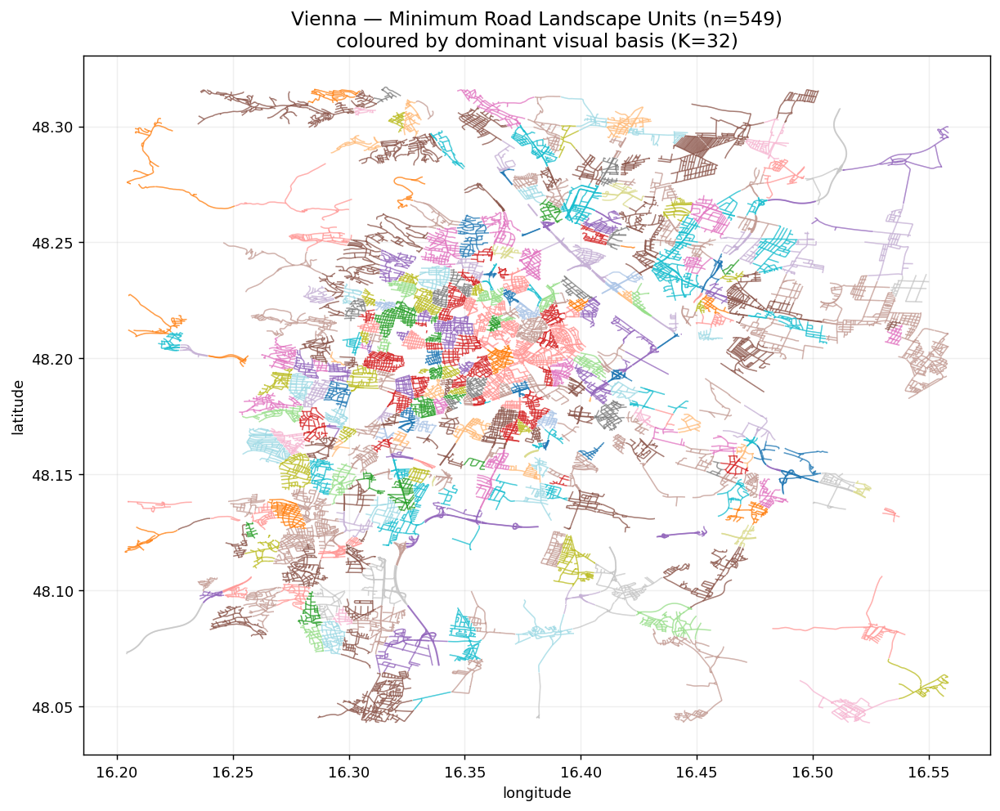
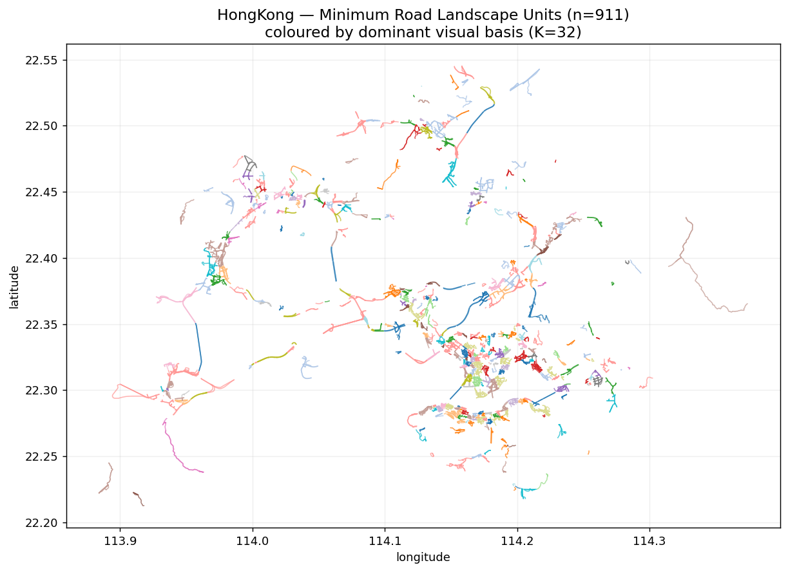

# Urban Visual Gene — 道路型最小景观单元（MRLU）

基于街景视觉特征，将城市路网自动切分为**视觉同质的最小道路景观单元**（Minimum Road-based Landscape Unit, MRLU）。

## 方法概览

```
Y = Enc(I)                 街景图像 → 4 方向 DINOv2 特征 concat (D=3072, L2 归一化)
Z_road = P_Groad(Y)        点特征经距离衰减聚合到路网节点（多路段非归一化加权）
Z_road ≈ A · X             稀疏自编码器学习视觉基 X (K×D) 与激活 A (M×K, ≥0)
U = R(A, G_road)           相邻节点激活余弦距离超阈值处断边 → 连通分量 = MRLU
```

完整 7 阶段：Stage1 特征提取 → Stage2 地图匹配 → Stage3 Z_road 上下文 → Stage4 稀疏基学习 → Stage5 激活推断 → Stage6 单元提取 →（Stage7 baseline）。

## 目录结构

```
scripts/        各阶段实现（均可 import，也支持 CLI）
  stage1_extract_pano_features.py    4 方向 DINOv2 特征
  stage2_map_match_road.py           UTM 地图匹配 + 路网图
  stage3_build_road_context_features.py
  stage4_train_road_basis_model.py   稀疏自编码器
  stage5_infer_road_basis_activation.py
  stage6_extract_road_units.py       MRLU 提取
  road_graph_utils.py / road_basis_model.py / io_utils.py
  copy_data.py                       从 NAS 复制数据到本地 ./data
  plot_results.py                    出图
tests/          48 个合成数据单元测试（pytest，CPU，无需真实数据/GPU）
run_experiment.py    端到端实验入口（Vienna / HongKong）
outputs/        EXPERIMENT_REPORT.md + figures/ + 统计（大产物已 gitignore）
```

## 运行

```bash
# 依赖
pip install pytest numpy pandas scipy networkx geopandas shapely torch matplotlib

# 测试
pytest tests/ -q

# 实验（读本地 ./data，需先用 scripts/copy_data.py 准备数据）
#   注意：Stage1(DINOv2) 需与 Stage2-6 分进程运行，避免 native 库 segfault
python run_experiment.py --city Vienna   --max-panos 500 --K 32 --epochs 50 --skip-stage1
python run_experiment.py --city HongKong --max-panos 500 --K 32 --epochs 50 --skip-stage1
```

## 实验结果（每城 500 抽样点）

> 配置：4 方向 DINOv2-ViT-B/14 concat（D=3072）；稀疏自编码器 K=32、hidden=512、epochs=50、`lambda_sparse=5e-3`、`lambda_spatial=1e-3`、`lambda_div=1e-3`；全程读本地数据，不访问 NAS。

### 全流程指标

| 指标 | Vienna | HongKong |
|------|-------:|---------:|
| 抽样街景点 / 缺失图片 | 500 / 0 | 500 / 0 |
| 街景点匹配率 | 500/500 (100%) | 499/500 (99.8%) |
| 道路图节点 / 边 | 237,590 / 509,346 | 247,772 / 548,074 |
| 有 pano 直接覆盖的节点 | 9,656 (4.1%) | 17,806 (7.2%) |
| 训练节点（覆盖子集）train/val | 8,691 / 965 | 16,026 / 1,780 |
| 重建误差 (mean cosine) | 0.220 | 0.237 |
| 激活稀疏度 (median active / 32) | 18 | 9 |
| 激活边界数 | 20,206 | 43,558 |
| **MRLU 单元数** | **611** | **911** |
| 单进程耗时 | 89 s | 106 s |

### 单元统计（`unit_statistics.csv`）

| 统计量 | Vienna (611) | HongKong (911) |
|--------|-------------:|---------------:|
| 每单元路网节点 mean / median | 165.5 / 96 | 84.0 / 37 |
| 每单元 pano mean / median | 12.3 / 10 | 13.0 / 8 |
| 单元道路长度 (m) mean / median | 3,696 / 2,214 | 1,822 / 825 |
| 激活熵 mean | 3.35 | 3.33 |
| 单元置信度 mean | 0.53 | 0.53 |
| 边界对比度 mean | 0.11 | 0.11 |
| 主导基（dominant basis）覆盖 | 32 / 32 | 32 / 32 |

### 两城对比图


**(a)** 香港单元数（911）多于 Vienna（611）；**(b)** 香港单元道路长度整体偏短（峰值 500–1000m），Vienna 偏长（3–6km）；**(c)** 香港每单元节点集中在 10–50，Vienna 偏 100–300；**(d)** 32 个视觉基全部被用到，两城各有偏好（香港 basis 27/7/11 突出，Vienna basis 30/18/31 突出）。

### MRLU 空间分布（按主导视觉基着色）

| Vienna | Hong Kong |
|:---:|:---:|
|  |  |

同色路段在空间上聚成片 = 视觉相似的连续街景被划入同一单元。

### MRLU 按单元长度着色（log）

| Vienna | Hong Kong |
|:---:|:---:|
|  |  |

黄色长单元多在城市外围/快速路（视觉单调、边界少）；蓝绿短单元集中在市中心高异质区。

### 核心观察

- **香港比 Vienna 切得更多更细**（911 vs 611，中位 37 vs 96 节点），且激活更稀疏（median 9 vs 18）——符合「香港高密度异质街景 → 更频繁的视觉边界」的直觉。
- 32 个学到的视觉基在两城激活出**不同的主导模式**，说明基具备跨城区分能力。

### 已知局限

- **边界阈值 τ=0**：两城激活余弦距离的 0.90 分位都为 0（>90% 相邻节点激活完全相同），实际成了「只要有差异即设边界」，单元对噪声偏敏感。建议改用非零分位阈值，或 Stage4 末端用 ReLU / top-k 激活以获得精确零值、增强区分度。
- **覆盖率低（4–7%）**：500 抽样点仅覆盖路网很小一部分，LCC 偏碎（Vienna 77.7%、HK 59.9%），多数单元几何来自插值节点，置信度普遍 ~0.53。扩大抽样量（5k–全量）可显著改善。

> 完整说明见 [`outputs/EXPERIMENT_REPORT.md`](outputs/EXPERIMENT_REPORT.md)。

## 数据

街景图像与路网元数据**不随仓库分发**（`data/` 已 gitignore）。用 `scripts/copy_data.py` 从数据源准备到本地 `./data/SVIs/GSV`。
