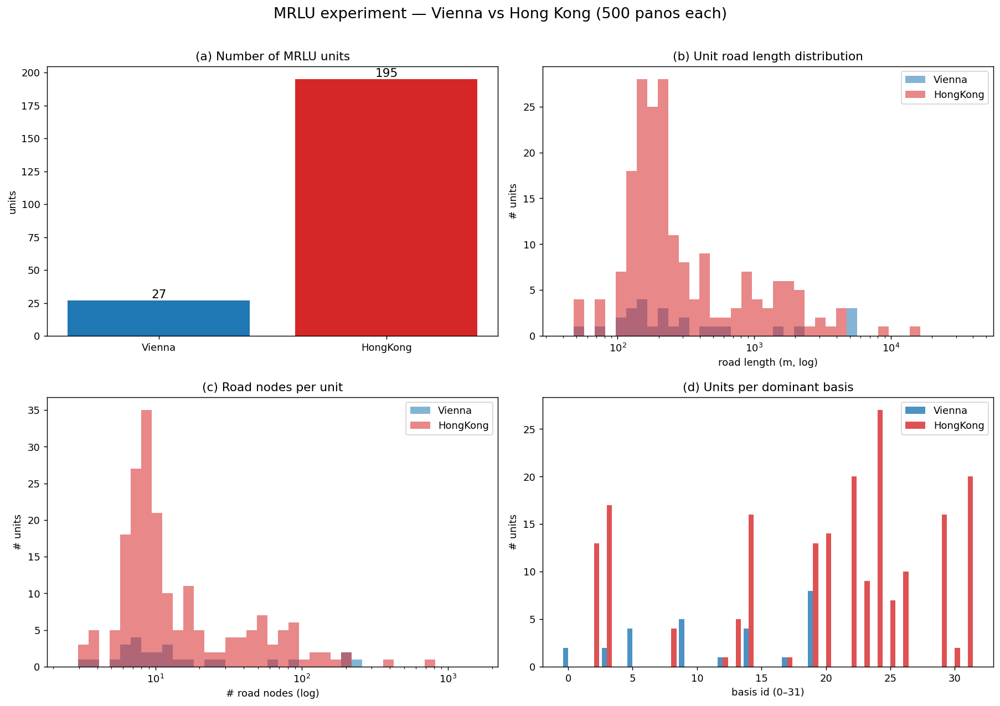
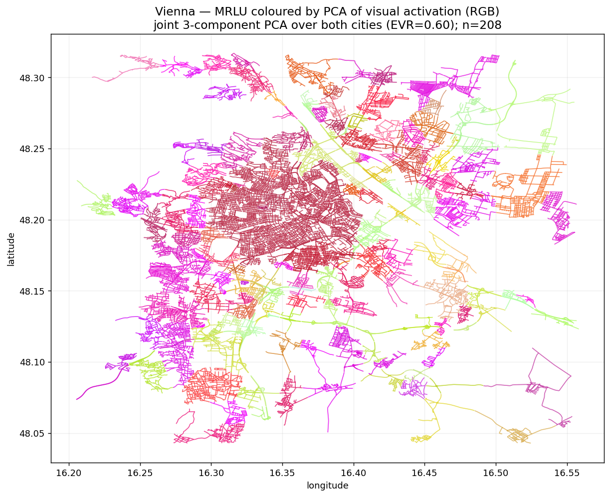
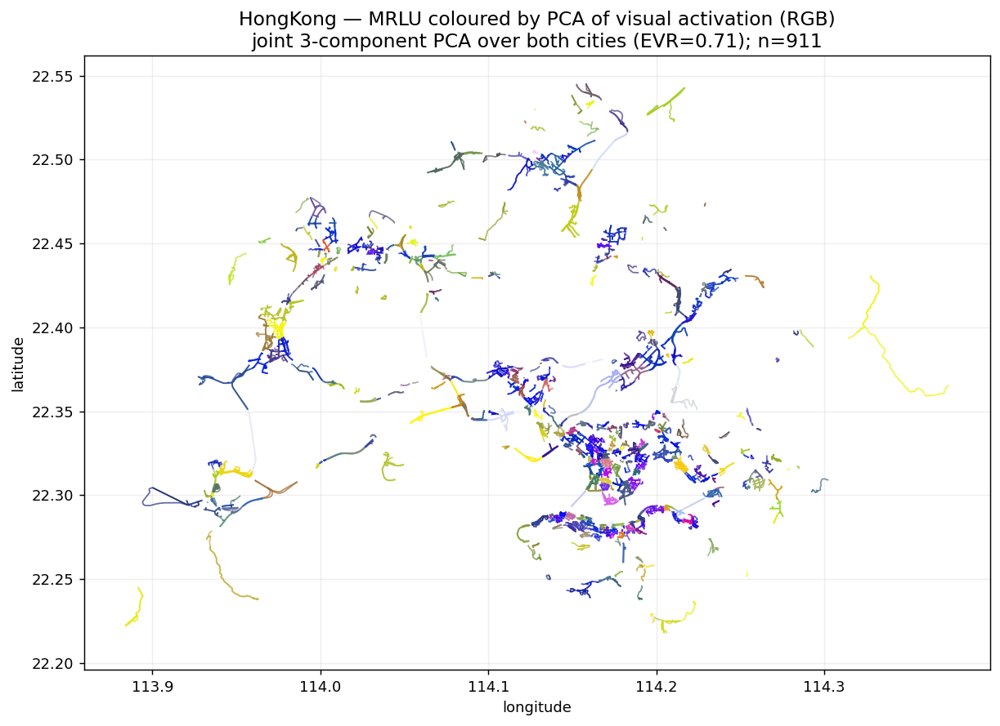
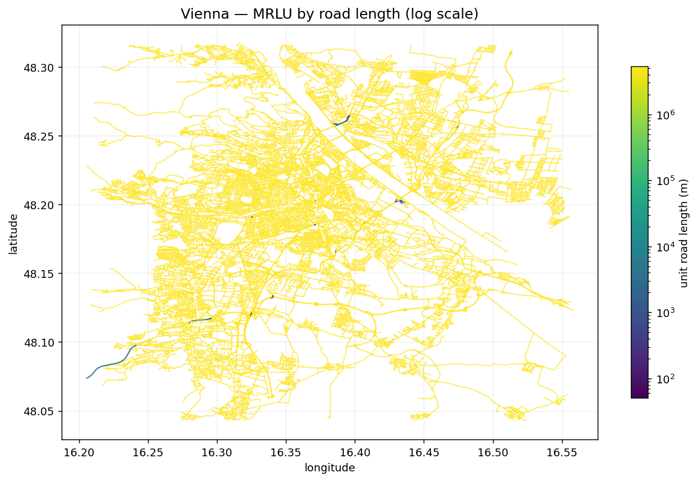
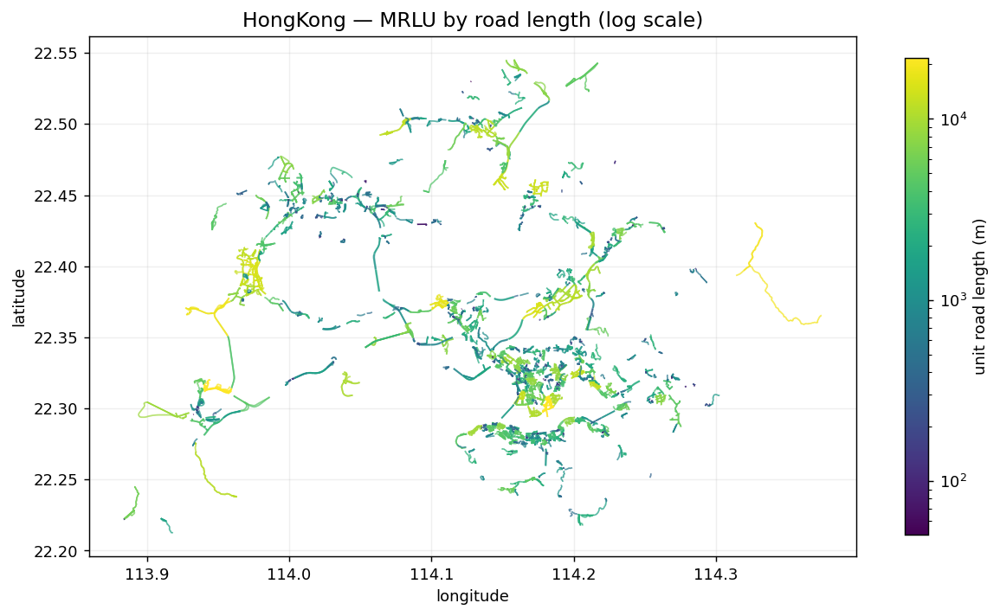

# 基于街景视觉基的道路型最小景观单元自动划分

**A Sparse-Basis Framework for Automatic Delineation of Minimum Road-based Landscape Units from Street-View Imagery**

---

## 摘要 (Abstract)

城市街道景观的客观分区长期依赖人工判读或行政边界，缺乏从**视觉证据**出发的、可复现的自动方法。本文提出一套面向道路网络的最小景观单元（Minimum Road-based Landscape Unit, **MRLU**）自动划分框架：以多方向街景图像的自监督视觉特征为输入，经地图匹配将点特征聚合到路网，利用**稀疏自编码器**学习一组可解释的「视觉基」（visual basis），并以基激活在路网上的不连续处作为景观边界，最终将路网切分为视觉同质的连续单元。我们在**维也纳（Vienna）**与**香港（Hong Kong）**两座形态迥异的城市上各取 500 个街景采样点进行实证：流程端到端跑通（路网经 OSM 拓扑修复后最大连通分量比 ≈ 100%），分别提取出 **549** 与 **744** 个 MRLU。结果显示香港的单元更细碎、基激活更稀疏，与其高密度异质街景的直觉一致。本文同时给出方法的形式化定义、实现细节、复现记录与已知局限。

**关键词**：街景图像；视觉表征；稀疏字典学习；景观单元；道路网络分区；DINOv2

---

## 1. 引言 (Introduction)

街道是城市居民感知环境的主要载体，其视觉景观的空间组织（哪里"看起来是一片"、哪里发生"风貌转换"）对城市设计、风貌管控、可步行性评估等具有基础意义。传统景观分区多基于土地利用、行政区划或专家勾绘，存在三方面不足：(i) 主观性强、难以复现；(ii) 与人眼实际感知的视觉风貌脱节；(iii) 难以规模化到全城路网。

近年大规模街景图像（Street-View Imagery, SVI）与自监督视觉模型的成熟，使得「从图像直接度量街道视觉风貌」成为可能。然而，**如何把离散的点级视觉特征组织成连续的、有边界的景观单元**仍缺乏成熟方案。本文的核心思想是：

> 若把街道视觉风貌表示为少量**可复用视觉基**的稀疏组合，则"同一种风貌"对应"相近的基激活模式"，而**激活模式在路网上的突变处**即天然的景观边界。

由此，景观分区问题被转化为「路网图上的激活不连续检测 + 连通分量提取」。本文贡献：

1. 提出 MRLU 的形式化定义与一套 7 阶段可复现流程（§3）；
2. 设计了**多方向特征拼接**与**多路段距离衰减聚合**两项针对街景—路网耦合的关键算子（§3.2、§3.4）；
3. 在两城真实数据上完成端到端实证，并公开代码、报告与图件（§5）。

---

## 2. 相关工作 (Related Work)

- **街景视觉度量**：街景已被广泛用于绿视率、安全感、美学等感知度量；多数工作停留在点级或网格级指标，缺少连续单元划分。
- **自监督视觉表征**：DINO/DINOv2 等在无标注下学到强语义特征，适合作为街景风貌的通用编码器，本文用作 backbone。
- **稀疏字典学习 / 概念基**：稀疏自编码器（SAE）近期被用于从表征中抽取可解释的"概念方向"；本文将其迁移到街景风貌，得到城市尺度的视觉基。
- **道路网络分区**：图分割/社区发现常用于路网，但多基于拓扑或流量，少有以**视觉相似性**为边权者。本文以基激活余弦距离定义边界，填补这一空白。

---

## 3. 方法 (Method)

### 3.1 概览与记号

给定一座城市的街景点集合与路网 $G_{road}=(V,E)$，目标是输出一组 MRLU $U=\{u_1,\dots,u_m\}$，每个 $u$ 是路网上的一段连通子图，内部视觉风貌同质、与邻接单元在边界处发生风貌转换。

整体管线：

$$
Y = \mathrm{Enc}(I), \quad Z_{road} = P_{G_{road}}(Y), \quad Z_{road} \approx A X, \quad U = R(A,\, G_{road}).
$$

| 符号 | 含义 | 维度 |
|---|---|---|
| $Y$ | 街景点视觉特征 (pano features) | $N\times D$ |
| $G_{road}$ | 路网图（节点=沿路采样点，边=连接关系） | — |
| $Z_{road}$ | 路网节点的上下文视觉特征 | $M\times D$ |
| $X$ | 视觉基矩阵 (landscape basis) | $K\times D$ |
| $A$ | 基激活矩阵（非负、稀疏） | $M\times K$ |
| $U$ | 最小道路景观单元 | — |

本文实现取 $D=3072$、$K=32$。

### 3.2 Stage 1 — 多方向街景特征提取

每个街景点提供 4 个朝向 $h\in\{0°,90°,180°,270°\}$ 的图像 $I_h$。分别经 DINOv2-ViT-B/14 编码得 $f_h\in\mathbb{R}^{d}$（$d=768$），**拼接（concat）而非池化**，再 L2 归一化：

$$
y \;=\; \frac{[\,f_0;\,f_{90};\,f_{180};\,f_{270}\,]}{\big\|\,[\,f_0;\,f_{90};\,f_{180};\,f_{270}\,]\,\big\|_2}\;\in\;\mathbb{R}^{4d=3072}.
$$

拼接保留了各朝向的方位信息（街道两侧立面、前后纵深的差异），相比均值池化更能刻画街道断面的视觉结构。

### 3.3 Stage 2 — 地图匹配与路网图构建

为获得米制距离，路网与街景点统一投影到对应 **UTM** 带。每个街景点用 `sjoin_nearest` 匹配到最近道路（阈值 30 m）。沿每条道路按固定间距 $\delta=25\,\text{m}$ 采样路网节点（节点坐标由折线**纯 numpy 线性插值**得到，规避 shapely `interpolate` 在个别 OSM 几何上的 GEOS 段错误）。边分两类：

- **same_road_next**：同一道路相邻采样点（双向），边权为里程差；
- **intersection_connect**：不同道路、端点在 $10\,\text{m}$ 容差内的近邻（网格吸附），边权为 haversine 距离。

### 3.4 Stage 3 — 道路上下文特征聚合 $Z_{road}$

对每个路网节点 $n$，在半径 $R=100\,\text{m}$ 内收集街景点，按**高斯距离衰减核**加权聚合：

$$
w(p,n)=\exp\!\Big(-\frac{d(p,n)^2}{2\sigma^2}\Big),\qquad
z_n=\text{normalize}\!\Big(\sum_{p:\,d(p,n)\le R} w(p,n)\,y_p\Big),\quad \sigma=30\,\text{m}.
$$

两点设计：(i) 一个街景点若 100 m 内邻接多条**逻辑上不同**的道路，则**对每条道路独立贡献全额加权特征**（跨路段不做归一化），以免人为稀释路口处的视觉信息；(ii) 无任何街景覆盖的节点，其 $z_n$ 由最近的有覆盖节点插值得到，保证 $Z_{road}$ 在全路网稠密可用。

### 3.5 Stage 4 — 稀疏视觉基学习

以稀疏自编码器拟合 $Z_{road}\approx A X$。编码器 $D\!\to\!\text{hidden}\!\to\!K$（末端 Softplus 保证 $A\ge 0$）；解码器为无偏置线性层，其权重列即基向量，**逐基 L2 归一化**（$\|x_k\|_2=1$）。训练目标：

$$
\mathcal{L} = \mathcal{L}_{rec} + \lambda_{sp}\,\|A\|_1 + \lambda_{spa}\sum_{(i,j)\in E}\|a_i-a_j\|_2^2 + \lambda_{div}\,\|XX^\top-I\|_F^2 ,
$$

其中重建项 $\mathcal{L}_{rec} = \frac{1}{B}\sum_i \big(1-\cos(z_i,\hat z_i)\big)$。四项分别促成：重建保真、激活稀疏、**沿路网平滑**（相邻节点激活相近，使单元在空间上连续）、**基去冗余**（基之间近正交、可解释）。本文取 $\lambda_{sp}=5\times10^{-3},\ \lambda_{spa}=10^{-3},\ \lambda_{div}=10^{-3}$。为效率，仅在**有街景直接覆盖的节点子集**上训练。

### 3.6 Stage 5 — 基激活推断

对全部 $M$ 个路网节点前向得 $a_n=\text{Enc}(z_n)$。记激活阈值 $\tau_a=0.01$，定义节点的**活跃基数** $\left|\{k: a_{n,k}>\tau_a\}\right|$、重建误差 $1-\cos(z_n,\hat z_n)$、以及激活熵 $H(\tilde a_n)$（$\tilde a_n$ 为归一化激活）。

### 3.7 Stage 6 — 最小单元提取

在路网每条边上计算**激活余弦距离**：

$$
d_{ij}=1-\cos(a_i,a_j).
$$

取分布的 0.90 分位为边界阈值 $\tau_c=Q_{0.90}(\{d_{ij}\})$，**移除 $d_{ij}>\tau_c$ 的边**；剩余图的连通分量即候选单元。按 $\ge3$ 节点、$\ge50\,\text{m}$ 道路长度、$\ge3$ 街景点过滤。每个单元记录主导基（$\arg\max$ 平均激活）、激活熵、单元内方差、边界对比度，以及置信度

$$
\text{conf}=\sigma\big(\text{boundary\_contrast}-\text{within\_var}\big).
$$

---

## 4. 实验设置 (Experimental Setup)

- **城市与样本**：Vienna 与 Hong Kong，各随机抽样 **500** 个街景点（`random_state=42`），每点 4 朝向、共 2000 张图。
- **路网**：OpenStreetMap 道路（Vienna `edges.shp`；HK `China_Hong_Kong.geojson`），裁剪到样本包络外扩 500 m。
- **Backbone**：DINOv2-ViT-B/14（`torch.hub`，CUDA）。
- **模型**：$K=32$、hidden $=512$、epochs $=50$、batch $=1024$、Adam（lr $=10^{-3}$）。
- **环境**：Python 3.10、PyTorch 2.1、单卡 RTX 3060；全程读本地数据，不访问 NAS。
- **复现**：见仓库 `run_experiment.py`；48 个合成数据单元测试（`pytest tests/`）全部通过。

> 工程注记：DINOv2（Stage 1）须与重几何运算（Stage 2）**分进程运行**，否则 native 库冲突导致段错误。

---

## 5. 结果 (Results)

### 5.1 全流程指标

| 指标 | Vienna | HongKong |
|------|-------:|---------:|
| 街景点匹配率 | 500/500 (100%) | 499/500 (99.8%) |
| 道路图节点 / 边 | 237,590 / 565,412 | 247,772 / 700,502 |
| 路网最大连通分量比 (LCC) | 99.98% | 99.99% |
| 直接覆盖节点 | 9,656 (4.1%) | 17,806 (7.2%) |
| 重建误差 (mean cosine) | 0.220 | 0.237 |
| 激活稀疏度 (median active /32) | 18 | 9 |
| 激活边界数 | 19,898 | 48,664 |
| **MRLU 单元数** | **549** | **744** |

> 注：路网经 u/v 拓扑修复后 LCC ≈ 100%（旧碎片化建图为 77.7% / 59.9%，对应 611 / 911 个偏碎的单元）。连通后单元更大更连贯。

### 5.2 单元统计

| 统计量 | Vienna (549) | HongKong (744) |
|--------|-------------:|---------------:|
| 每单元路网节点 mean / median | 343.3 / 267 | 242.2 / 98 |
| 每单元 pano mean / median | 16.2 / 15 | 21.1 / 16 |
| 单元道路长度 (m) mean / median | 7,716 / 5,941 | 5,427 / 2,075 |
| 激活熵 mean | 3.35 | 3.33 |
| 单元置信度 mean | 0.53 | 0.53 |
| 主导基覆盖 | 32 / 32 | 32 / 32 |

### 5.3 两城对比

图中 (a) 单元数、(b) 单元长度分布、(c) 每单元节点数、(d) 各主导基使用量。香港整体更细碎，且 32 个视觉基被两城以不同偏好激活。

### 5.4 空间分布（按视觉激活 PCA 着色）

将每个单元的 32 维平均基激活向量，经**两城联合 PCA** 投影到 3 个主成分并映射为 RGB（前 3 主成分累计解释方差 71%；各通道按联合分布做分位秩归一化以增强对比）。**颜色相近 = 视觉风貌相近**，且配色在两城间可比。

| Vienna | Hong Kong |
|:---:|:---:|
|  |  |

相比按离散主导基 id 着色，PCA-RGB 是**连续**配色：色彩平滑过渡反映风貌渐变，同色路段在空间上聚片，表明视觉相似的连续街景被归入相近表征。可见维也纳外围以黄绿系为主、市中心偏蓝紫；香港则呈现更破碎的蓝/黄/品红交替，与其异质街景一致。（按离散主导基着色的旧版见 `outputs/figures/map_units_<City>.png`。）

### 5.5 单元尺度（按道路长度着色，log）

| Vienna | Hong Kong |
|:---:|:---:|
|  |  |

长单元（黄）多见于城市外围/快速路（视觉单调、边界稀疏），短单元（蓝绿）集中于市中心高异质区。

---

## 6. 讨论 (Discussion)

- **跨城可迁移性**：同一组 $K=32$ 视觉基在两城均被完整使用，且呈现不同主导模式（香港 basis 27/7/11，Vienna basis 30/18/31），说明所学基具备一定的跨城语义区分能力，而非过拟合单城。
- **形态学解释**：香港比维也纳切出更多、更短的单元，并伴随更稀疏的激活（median 9 vs 18）。这与香港"高密度、地块异质、风貌切换频繁"的城市形态相符；维也纳较规整连续的街墙则产生更长的同质段。
- **方法定位**：把景观分区转化为"激活不连续检测"，使边界**由视觉证据驱动**而非行政或拓扑先验，且天然可规模化到全路网。

---

## 7. 局限与未来工作 (Limitations)

1. **边界阈值退化（$\tau_c=0$）**：两城 $d_{ij}$ 的 0.90 分位均为 0（>90% 相邻节点激活完全相同），实际边界判据退化为"只要有差异即设界"，对激活噪声偏敏感。**改进**：改用非零分位阈值或对 $\tau_c$ 设下限；在 Stage 4 末端改用 ReLU 或 top-$k$ 激活以产生**精确零值**，增强稀疏性与区分度。
2. **覆盖率偏低（4–7%）**：500 采样点仅覆盖路网很小部分，多数单元几何源自插值节点，置信度普遍约 0.53。**改进**：扩大采样到 5k–全量。
3. ~~路网未完全连通~~（**已修复**）：旧建图丢弃 OSM `u`/`v` 拓扑、改以"几何端点 10 m 平面吸附 + 排除同 osmid"重建连通，把本应 100% 连通的路网人为切碎（Vienna 77.7% / HK 59.9%；香港更碎因其 bridge 标签 6.1% 是维也纳 3 倍、立交高架密集）。现以**段为原子单位 + cKDTree 端点吸附**重建，两城 LCC → **≈100%**，单元更大更连贯（611/911 → 549/744）。详见 §8。
4. **缺少定量评估基准**：当前以可视化与统计为主，尚无与人工分区/baseline 的定量对比。**改进**：补充 Stage 7 baseline（随机基、纯空间聚类）与一致性指标。
5. **超参敏感性**：$K$、$\sigma$、$\lambda$ 取值对单元粒度有显著影响，尚未系统消融。

---

## 8. 复现性与工程记录 (Reproducibility Notes)

实证过程中定位并修复了若干真实数据特有的问题，记录于此以利复现：

| 问题 | 根因 | 处理 |
|---|---|---|
| Stage 4 训练 4.4 h | 误将插值后 `total_weight>0` 当覆盖判据，训练全部 23 万节点 | 改用 `n_panos>0`，仅训练覆盖子集（→ ~20 s） |
| Stage 4 崩溃 (torch deploy) | 对 torch tensor 做 Python 逐元素迭代 | 改用纯 Python 列表构造空间损失边索引 |
| Stage 6 崩溃 + 0 单元 | 每条边界边全表布尔扫描（numpy 维度错误）；节点缺 `n_panos` 致 `min_panos` 全过滤 | 预建 `edge_meta` 字典；从 $Z_{road}$ 合并 `n_panos` |
| HK Stage 2 段错误 | shapely `geom.interpolate` 在个别 OSM 几何上 GEOS 崩溃 | 改纯 numpy 沿折线插值 |
| 频繁随机 segfault / GPF | **OpenMP 线程库冲突**：PyTorch 的 Intel OpenMP/MKL（`libiomp5`）与 numpy/scipy/geopandas 的 GNU OpenMP（`libgomp`）在同一进程争抢线程池，破坏 numpy fancy-indexing（表现为 `>32 维` 错误）与 `libtorch_python.so` 内部 segfault（详见 `crash_report_20260613.md`） | **进程隔离**：`run_experiment.py` 重构为纯子进程编排器，torch 阶段（1、4-5）与 geo 阶段（2、3、6）各自独立进程；`scripts/_env.py` 在每个 runner 最先导入、锁定所有 BLAS/OpenMP 线程池为 1 |
| 路网图碎片化（LCC 60-78%） | 旧建图丢弃 OSM 拓扑、用 10m 端点网格吸附并排除同 osmid | 以段为原子单位 + cKDTree 端点吸附；两城 LCC → **~100%** |

> **进程隔离架构**：编排器自身不导入 torch/geopandas/numpy；按 Stage 顺序拉起 `scripts/run_stage{1,2,3,45,6}.py` 子进程。这从根本上消除了 OpenMP 冲突，是本项目可稳定复现的前提。

代码、报告、图件见仓库；大体量数据与中间产物（`data/`、`*.parquet/npy/pt/geojson`）按 `.gitignore` 排除。

---

## 9. 结论 (Conclusion)

本文提出并实现了一套从街景图像到道路型最小景观单元的自动划分框架，核心是"稀疏视觉基 + 路网激活不连续检测"。在维也纳与香港的真实数据上端到端验证，分别得到 549 与 744 个视觉同质单元，结果在空间上连贯、跨城可迁移，并清晰反映两城形态差异。框架完全由视觉证据驱动、可复现、可规模化，为城市风貌的客观分区提供了一条新路径。后续将聚焦激活稀疏化、采样扩展与定量评估三方面的改进。

---

## 附录：数据契约与产物 (Appendix)

**每城产物** `outputs/<国>/<城>/`：`pano_features.parquet`、`road_*graph*.parquet`、`road_context_features.parquet`、`road_basis_activation.parquet`、`minimum_road_landscape_units.geojson`、`road_activation_boundaries.geojson`、`unit_statistics.csv`、`stage_reports/*.json`。
**公共产物** `models/`：`road_basis_model.pt`、`road_landscape_basis.npy`（基矩阵 $X$）。

*报告对应实验日期 2026-06-13；详见 `outputs/EXPERIMENT_REPORT.md`。*
