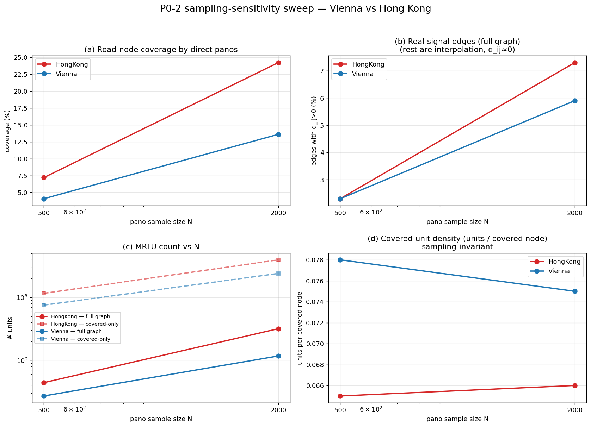
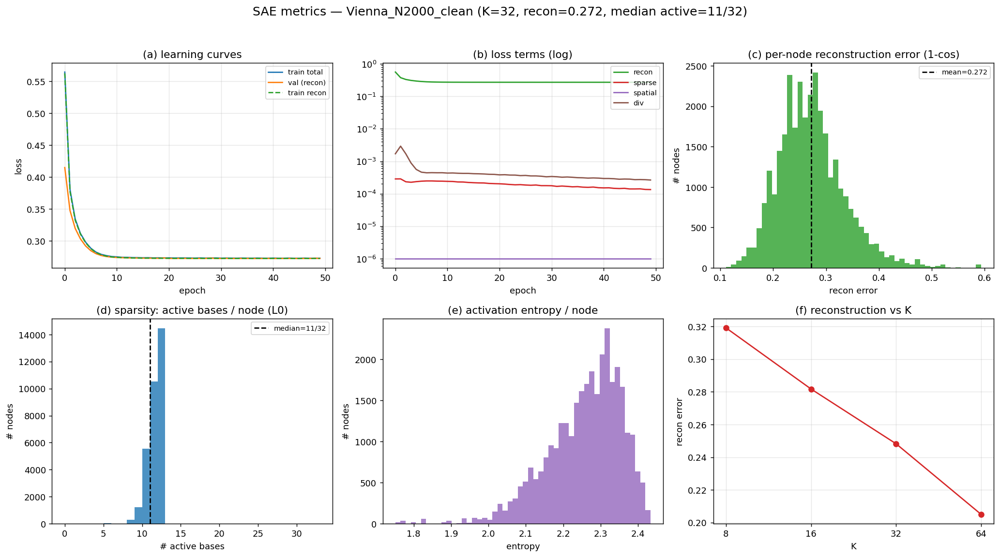
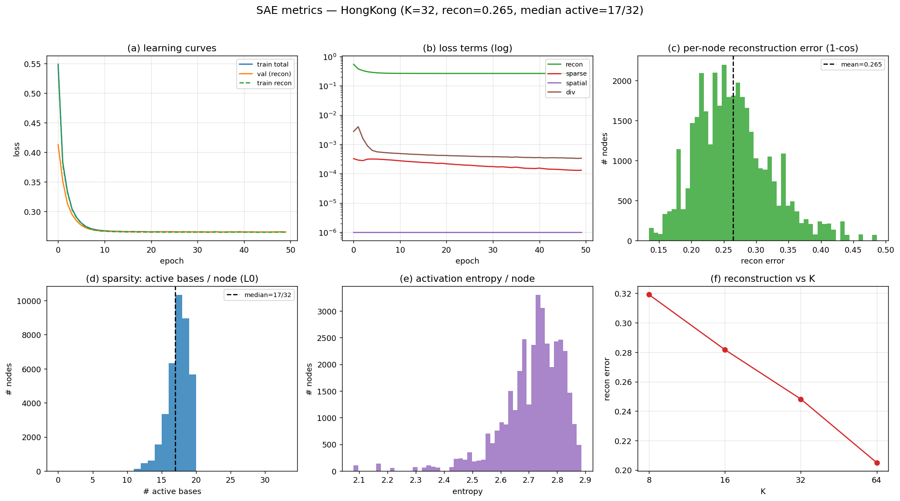
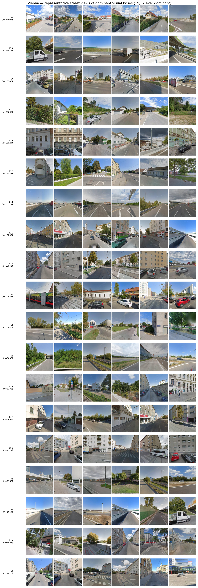
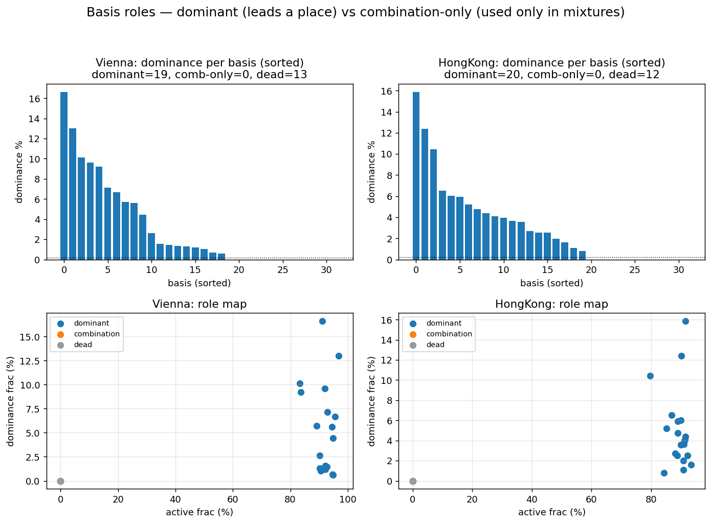
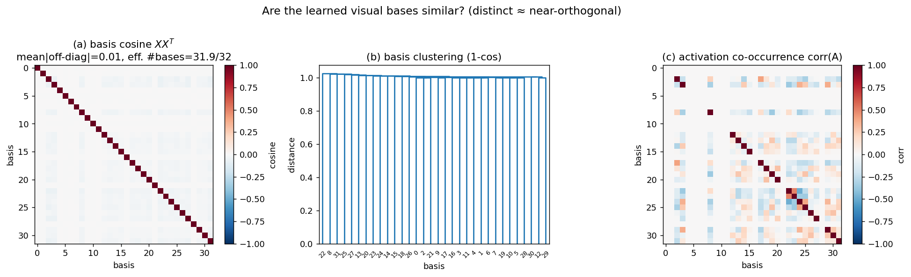
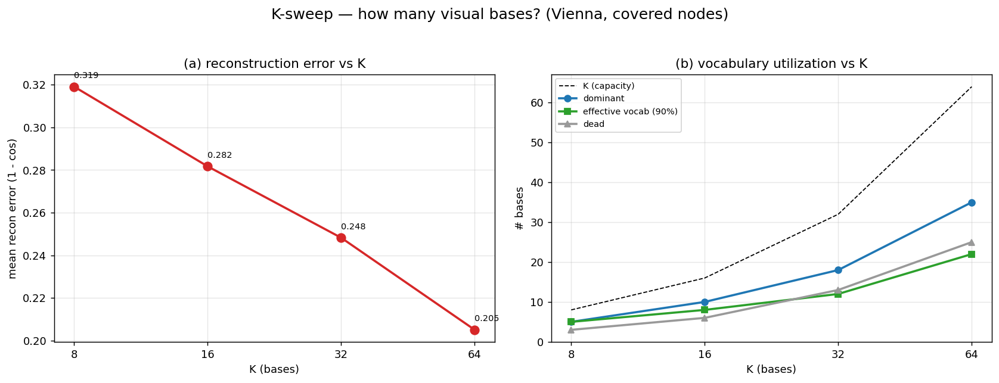
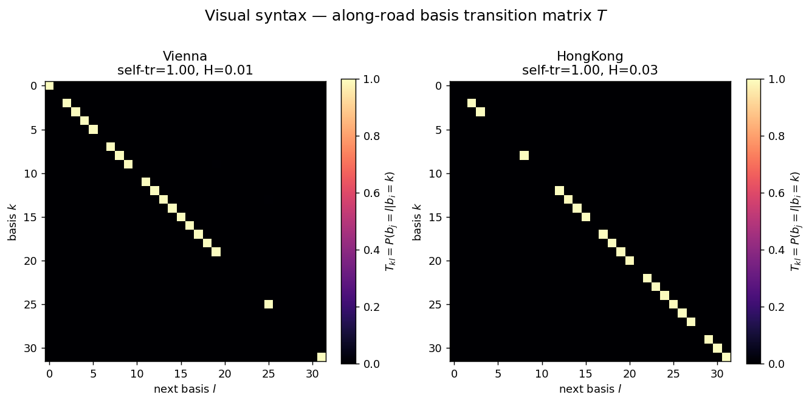
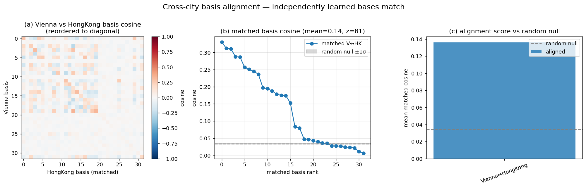

# 基于街景视觉基的道路型最小景观单元自动划分

**A Sparse-Basis Framework for Automatic Delineation of Minimum Road-based Landscape Units from Street-View Imagery**

---

## 摘要 (Abstract)

城市街道景观的客观分区长期依赖人工判读或行政边界，缺乏从**视觉证据**出发的、可复现的自动方法。本文提出一套面向道路网络的最小景观单元（Minimum Road-based Landscape Unit, **MRLU**）自动划分框架：以多方向街景图像的自监督视觉特征为输入，经地图匹配将点特征聚合到路网，利用**稀疏自编码器**学习一组可解释的「视觉基」（visual basis），并以基激活在路网上的不连续处作为景观边界，最终将路网切分为视觉同质的连续单元。我们在**维也纳（Vienna）**与**香港（Hong Kong）**两座形态迥异的城市上进行实证（路网经 OSM 拓扑修复后最大连通分量比 ≈ 100%，以轻量质量分类器剔除眩光/暗/损坏图，并以**贪心最大覆盖采样**减少插值、**沿路网图扩散 + 覆盖置信度门控**填充与约束无观测区）。结果显示：MRLU 的绝对数量是**尺度依赖**的（随采样密度变化，§5.6），而稳定的规律体现在归一化指标与组合结构上——两城**共享一组近正交的视觉基**（词汇），却在基的频率、组合熵与沿路网转移矩阵（语法）上显著不同，香港呈现更频繁的视觉突变与略大的视觉词汇。本文同时给出方法的形式化定义、实现细节、复现记录与已知局限。

**关键词**：街景图像；视觉表征；稀疏字典学习；景观单元；道路网络分区；DINOv2

---

## 1. 引言 (Introduction)

街道是城市居民感知环境的主要载体，其视觉景观的空间组织（哪里"看起来是一片"、哪里发生"风貌转换"）对城市设计、风貌管控、可步行性评估等具有基础意义。传统景观分区多基于土地利用、行政区划或专家勾绘，存在三方面不足：(i) 主观性强、难以复现；(ii) 与人眼实际感知的视觉风貌脱节；(iii) 难以规模化到全城路网。

近年大规模街景图像（Street-View Imagery, SVI）与自监督视觉模型的成熟，使得「从图像直接度量街道视觉风貌」成为可能。然而，**如何把离散的点级视觉特征组织成连续的、有边界的景观单元**仍缺乏成熟方案。本文的核心思想是：

> 若把街道视觉风貌表示为少量**可复用视觉基**的稀疏组合，则"同一种风貌"对应"相近的基激活模式"，而**激活模式在路网上的突变处**即天然的景观边界。

由此，景观分区问题被转化为「路网图上的激活不连续检测 + 连通分量提取」。本文贡献：

1. 提出 MRLU 的形式化定义与一套 7 阶段可复现流程（§3）；
2. 设计了**多方向特征拼接**与**多路段距离衰减聚合**两项针对街景—路网耦合的关键算子（§3.2、§3.4）；
3. 在两城真实数据上完成端到端实证，并公开代码、报告与图件（§5）。

---

## 2. 相关工作 (Related Work)

- **街景视觉度量**：街景已被广泛用于绿视率、安全感、美学等感知度量；多数工作停留在点级或网格级指标，缺少连续单元划分。
- **自监督视觉表征**：DINO/DINOv2 等在无标注下学到强语义特征，适合作为街景风貌的通用编码器，本文用作 backbone。
- **稀疏字典学习 / 概念基**：稀疏自编码器（SAE）近期被用于从表征中抽取可解释的"概念方向"；本文将其迁移到街景风貌，得到城市尺度的视觉基。
- **道路网络分区**：图分割/社区发现常用于路网，但多基于拓扑或流量，少有以**视觉相似性**为边权者。本文以基激活余弦距离定义边界，填补这一空白。

---

## 3. 方法 (Method)

### 3.1 概览与记号

给定一座城市的街景点集合与路网 $G_{road}=(V,E)$，目标是输出一组 MRLU $U=\{u_1,\dots,u_m\}$，每个 $u$ 是路网上的一段连通子图，内部视觉风貌同质、与邻接单元在边界处发生风貌转换。

整体管线：

$$
Y = \mathrm{Enc}(I), \quad Z_{road} = P_{G_{road}}(Y), \quad Z_{road} \approx A X, \quad U = R(A,\, G_{road}).
$$

| 符号 | 含义 | 维度 |
|---|---|---|
| $Y$ | 街景点视觉特征 (pano features) | $N\times D$ |
| $G_{road}$ | 路网图（节点=沿路采样点，边=连接关系） | — |
| $Z_{road}$ | 路网节点的上下文视觉特征 | $M\times D$ |
| $X$ | 视觉基矩阵 (landscape basis) | $K\times D$ |
| $A$ | 基激活矩阵（非负、稀疏） | $M\times K$ |
| $U$ | 最小道路景观单元 | — |

本文实现取 $D=3072$、$K=32$。

### 3.2 Stage 1 — 多方向街景特征提取

每个街景点提供 4 个朝向 $h\in\{0°,90°,180°,270°\}$ 的图像 $I_h$。分别经 DINOv2-ViT-B/14 编码得 $f_h\in\mathbb{R}^{d}$（$d=768$），**拼接（concat）而非池化**，再 L2 归一化：

$$
y \;=\; \frac{[\,f_0;\,f_{90};\,f_{180};\,f_{270}\,]}{\big\|\,[\,f_0;\,f_{90};\,f_{180};\,f_{270}\,]\,\big\|_2}\;\in\;\mathbb{R}^{4d=3072}.
$$

拼接保留了各朝向的方位信息（街道两侧立面、前后纵深的差异），相比均值池化更能刻画街道断面的视觉结构。

### 3.3 Stage 2 — 地图匹配与路网图构建

为获得米制距离，路网与街景点统一投影到对应 **UTM** 带。每个街景点用 `sjoin_nearest` 匹配到最近道路（阈值 30 m）。沿每条道路按固定间距 $\delta=25\,\text{m}$ 采样路网节点（节点坐标由折线**纯 numpy 线性插值**得到，规避 shapely `interpolate` 在个别 OSM 几何上的 GEOS 段错误）。边分两类：

- **same_road_next**：同一道路相邻采样点（双向），边权为里程差；
- **intersection_connect**：不同道路、端点在 $10\,\text{m}$ 容差内的近邻（网格吸附），边权为 haversine 距离。

### 3.4 Stage 3 — 道路上下文特征聚合 $Z_{road}$

对每个路网节点 $n$，在半径 $R=100\,\text{m}$ 内收集街景点，按**高斯距离衰减核**加权聚合：

$$
w(p,n)=\exp\!\Big(-\frac{d(p,n)^2}{2\sigma^2}\Big),\qquad
z_n=\text{normalize}\!\Big(\sum_{p:\,d(p,n)\le R} w(p,n)\,y_p\Big),\quad \sigma=30\,\text{m}.
$$

两点设计：(i) 一个街景点若 100 m 内邻接多条**逻辑上不同**的道路，则**对每条道路独立贡献全额加权特征**（跨路段不做归一化），以免人为稀释路口处的视觉信息；(ii) 无街景覆盖的节点用**沿路网的图扩散（谐波插值）**填充——以覆盖节点为锚，未覆盖节点反复取**路网邻居的度归一化均值**，在观测之间形成**平滑过渡**而非硬复制（早期版本用欧氏最近邻复制，造成大片完全相同的 Voronoi 块，见 §5.6）。同时为每个节点赋**覆盖置信度** $c_i=\exp(-d_i^{\mathrm{near}}/\lambda)$（$\lambda=150\,\mathrm{m}$，$d_i^{\mathrm{near}}$ 为到最近观测节点的距离），供 Stage 6 门控。

### 3.5 Stage 4 — 稀疏视觉基学习

以稀疏自编码器拟合 $Z_{road}\approx A X$。编码器 $D\!\to\!\text{hidden}\!\to\!K$（末端 Softplus 保证 $A\ge 0$）；解码器为无偏置线性层，其权重列即基向量，**逐基 L2 归一化**（$\|x_k\|_2=1$）。训练目标：

$$
\mathcal{L} = \mathcal{L}_{rec} + \lambda_{sp}\,\|A\|_1 + \lambda_{spa}\sum_{(i,j)\in E}\|a_i-a_j\|_2^2 + \lambda_{div}\,\|XX^\top-I\|_F^2 ,
$$

其中重建项 $\mathcal{L}_{rec} = \frac{1}{B}\sum_i \big(1-\cos(z_i,\hat z_i)\big)$。四项分别促成：重建保真、激活稀疏、**沿路网平滑**（相邻节点激活相近，使单元在空间上连续）、**基去冗余**（基之间近正交、可解释）。本文取 $\lambda_{sp}=5\times10^{-3},\ \lambda_{spa}=10^{-3},\ \lambda_{div}=10^{-3}$。为效率，仅在**有街景直接覆盖的节点子集**上训练。

### 3.6 Stage 5 — 基激活推断

对全部 $M$ 个路网节点前向得 $a_n=\text{Enc}(z_n)$。记激活阈值 $\tau_a=0.01$，定义节点的**活跃基数** $\left|\{k: a_{n,k}>\tau_a\}\right|$、重建误差 $1-\cos(z_n,\hat z_n)$、以及激活熵 $H(\tilde a_n)$（$\tilde a_n$ 为归一化激活）。

### 3.7 Stage 6 — 最小单元提取

在路网每条边上计算**激活余弦距离**：

$$
d_{ij}=1-\cos(a_i,a_j).
$$

取分布的 0.90 分位为边界阈值 $\tau_c=Q_{0.90}(\{d_{ij}\})$，**移除 $d_{ij}>\tau_c$ 的边**；剩余图的连通分量即候选单元。按 $\ge3$ 节点、$\ge50\,\text{m}$ 道路长度、$\ge3$ 街景点过滤。

**覆盖置信度门控（默认开启，$c_{\min}=0.5$）**：$\tau_c$ 只在**两端置信度均 $\ge c_{\min}$ 的边**上估计，且只有这类「可信边」才允许成为边界——置信度不足（远离观测、由扩散外推）的边一律不切。这避免了纯扩散在无观测区域因激活近乎相同而把 $\tau_c$ 压到极小、从而过度切割（见 §5.6）。`run_experiment` 默认 `--min-confidence 0.5`（设 0 关闭）。每个单元记录主导基（$\arg\max$ 平均激活）、激活熵、单元内方差、边界对比度，以及置信度

$$
\text{conf}=\sigma\big(\text{boundary\_contrast}-\text{within\_var}\big).
$$

---

## 4. 实验设置 (Experimental Setup)

- **城市与样本**：Vienna 与 Hong Kong，各随机抽样 **500** 个街景点（`random_state=42`），每点 4 朝向、共 2000 张图。
- **路网**：OpenStreetMap 道路（Vienna `edges.shp`；HK `China_Hong_Kong.geojson`），裁剪到样本包络外扩 500 m。
- **Backbone**：DINOv2-ViT-B/14（`torch.hub`，CUDA）。
- **模型**：$K=32$、hidden $=512$、epochs $=50$、batch $=1024$、Adam（lr $=10^{-3}$）。
- **环境**：Python 3.10、PyTorch 2.1、单卡 RTX 3060；全程读本地数据，不访问 NAS。
- **复现**：见仓库 `run_experiment.py`；48 个合成数据单元测试（`pytest tests/`）全部通过。

> 工程注记：DINOv2（Stage 1）须与重几何运算（Stage 2）**分进程运行**，否则 native 库冲突导致段错误。

---

## 5. 结果 (Results)

### 5.1 全流程指标

下表为正式 N=500 全流程结果，采用当前完整配置：**贪心最大覆盖采样**（`--sampling greedy`，§5.6.2）+ **数据质量过滤**（`--exclude-bad`，剔除眩光/暗/损坏图）+ **路网图扩散插值 + 覆盖置信度门控 0.5**（§3.4、§3.7）；路网已用 OSM `u/v` 拓扑修复至 LCC≈100%，边界用 ReLU 稀疏激活 + 非零分位阈值（§5.9、§P0）。

| 指标 | Vienna | HongKong |
|------|-------:|---------:|
| 采样策略 | greedy 最大覆盖 | greedy 最大覆盖 |
| 质量过滤剔除坏 pano | 6/500 | 3/500 |
| 街景点匹配率 | 494/494 (100%) | 497/497 (100%) |
| 道路图节点 / 边 | 234,786 / 559,096 | 241,774 / 686,316 |
| 路网最大连通分量比 (LCC) | 99.89% | 99.82% |
| 直接覆盖节点 | 17,689 (7.5%) | 37,427 (15.5%) |
| 平均覆盖置信度 | 0.22 | 0.32 |
| 重建误差 (mean cosine) | 0.219 | 0.258 |
| 激活稀疏度 (median active /32) | 18 | 18 |
| 真信号边占比 / 激活边界数 | 20.6% / 2,530 | 16.6% / 3,870 |
| **MRLU 单元数（全图 N=500，门控）** | **27** | **195** |

> 注 1：质量过滤后**眩光伪影基被移除**——最像眩光的基的品红色偏从 0.221 降至 0.024（§5.9 末）。
> 注 2：相比旧的随机采样 + 最近邻复制流水线（Vienna 22 / HK 32 单元、真信号边仅 ~2.2%），贪心采样把直接覆盖近翻倍、扩散把真信号边占比提到 16–21%，故全图分割得到更多**锚定在观测区**的单元；与随机采样在同配置下的逐项对比见 §5.6.2。单元数仍是**尺度依赖量**，跨城比较应看归一化指标（§5.6 覆盖单元密度）与组合语法（§5.10）。

### 5.2 单元统计

| 统计量 | Vienna (27) | HongKong (195) |
|--------|------------:|---------------:|
| 每单元路网节点 median (mean*) | 11 (8,658) | 10 (1,232) |
| 单元道路长度 (m) median (mean*) | 232 (199,404) | 206 (28,272) |
| 每单元 pano median | 8 | 8 |
| 主导基覆盖 | 8 / 32 | 17 / 32 |

> \*mean 仍被极少数**巨型连通块**（覆盖大片低置信外推路网）拉高，**median 才具代表性**；贪心采样后 median 单元更小（节点 ~10、长度 ~200m），说明门控把边界更密集地落在观测覆盖区，香港主导基从 8 升至 17（更大的视觉词汇得以显现）。覆盖子图 / 更大 $N$ 的稳定结果见 §5.6。

### 5.3 两城对比

图中 (a) 单元数、(b) 单元长度分布、(c) 每单元节点数、(d) 各主导基使用量。香港整体更细碎，且 32 个视觉基被两城以不同偏好激活。

### 5.4 空间分布（按视觉激活 PCA 着色）

将每个单元的 32 维平均基激活向量，经**两城联合 PCA** 投影到 3 个主成分并映射为 RGB（前 3 主成分累计解释方差 60.2%，分量 0.415/0.115/0.071；各通道按联合分布做分位秩归一化以增强对比）。**颜色相近 = 视觉风貌相近**，且配色在两城间可比。

| Vienna | Hong Kong |
|:---:|:---:|
|  |  |

相比按离散主导基 id 着色，PCA-RGB 是**连续**配色：色彩平滑过渡反映风貌渐变，同色路段在空间上聚片，表明视觉相似的连续街景被归入相近表征。可见维也纳整体以**品红/粉为主、点缀黄绿**、配色相对均匀（视觉风貌较同质）；香港则呈现**绿/蓝/青/品红/黄交替的破碎拼贴**，色彩多样性明显更高，与其异质街景一致。（按离散主导基着色的旧版见 `outputs/figures/map_units_<City>.png`。）

### 5.5 单元尺度（按道路长度着色，log）

| Vienna | Hong Kong |
|:---:|:---:|
|  |  |

长单元（黄）多见于城市外围/快速路（视觉单调、边界稀疏），短单元（蓝绿）集中于市中心高异质区。

### 5.6 采样灵敏度（P0-2）

为检验结果是否受街景采样规模限制，对每城在 $N\in\{500,2000\}$ 个采样点上重跑流水线，并同时报告**全图分割**与**仅覆盖子图分割**（仅在有 pano 直接覆盖的节点/边上切，剔除约 95% 的插值节点）。

| 城市 | $N$ | 覆盖率 | 真信号边占比（全图） | 全图单元 | 覆盖单元 | 覆盖单元密度 |
|---|--:|--:|--:|--:|--:|--:|
| Vienna | 500 | 4.1% | 2.3% | 27 | 755 | 0.078 |
| Vienna | 2000 | 13.6% | 5.9% | 117 | 2411 | 0.075 |
| Vienna | 5000 | 24.0% | 11.6% | 350 | 4271 | **0.075** |
| 香港 | 500 | 7.2% | 2.3% | 44 | 1163 | 0.065 |
| 香港 | 2000 | 24.2% | 7.3% | 318 | 3977 | 0.066 |

三点观察：

1. **结果强烈受采样限制**：样本量增大时覆盖率、真信号边占比、全图/覆盖单元数均单调上升（图 a–c），说明小样本下的绝对单元数并非城市的稳定属性。
2. **全图分割仍被插值主导**：即便 $N=5000$，激活余弦距离非零的边也仅占 11.6%（图 b），其余近 90% 为插值复制（$d_{ij}\approx0$）。故应在覆盖子图上、而非插值全图上得出结论；若要在全图上稳定，需进一步增大 $N$。
3. **覆盖单元密度是采样不变量**：`覆盖单元 / 覆盖节点` 在 Vienna 跨 $N$ 收敛至 **0.075**（0.078→0.075→0.075），香港稳定在 ≈0.066，且两城取值不同——这是首个不随样本量漂移的描述量，宜作为**归一化的城市级指标**，替代易受采样影响的绝对单元数（亦回应"两城比较需标准化"的意见）。

#### 5.6.1 插值升级：路网图扩散 + 置信度门控（取代欧氏最近邻复制）

§5.6 的"插值主导"问题源于早期 Stage 3 用**欧氏最近邻复制**填充无覆盖节点：每个未观测节点硬抄最近观测节点的 $z$，在路网上形成大片**完全相同的 Voronoi 块**，块内 $d_{ij}\equiv0$、块界处突变，几乎不携带真实视觉梯度。我们改为**沿路网的图扩散（谐波插值，§3.4）**，并配以 §3.7 的覆盖置信度门控。同一 Vienna N=500 数据、同一分割规则下逐项对比（`outputs/sweep/interp_comparison.csv`）：

| 插值方案 | 携带信号的边占比 | 全图单元数 | 边界边数 |
|---|--:|--:|--:|
| 欧氏最近邻复制（旧） | 5.7% | 96 | — |
| 路网图扩散（仅 a） | **43%** | 813 | 24,270 |
| 图扩散 + 置信度门控 0.5（a+b，**默认**） | 43% | **159** | 6,820 |

两点结论：
1. **扩散把携带真实信号的边从 5.7% 提到 43%**——观测之间不再是硬复制的常数块，而是沿路网平滑过渡的视觉场，分割得以利用真实梯度而非 Voronoi 人工界。
2. **扩散须与门控同用**：单纯扩散在**无观测区域**激活近乎相同，把 $\tau_c$ 压到极小（$\sim0.004$），导致过度切割（813 个零散单元、24k 边界）。门控只在两端置信度 $\ge0.5$ 的可信边上估 $\tau_c$ 并设界，单元数回落到 **159**、边界 6,820，且**锚定在观测覆盖区**而非外推区。故 `run_experiment` 默认 `--min-confidence 0.5`，两者作为一个整体启用。

#### 5.6.2 采样策略：贪心最大覆盖（从源头减少插值）

§5.6.1 解决"怎么填"，本节解决"少填一些"。**为什么插值这么多**是个结构问题：路网按 $\delta=25\,\mathrm{m}$ 密铺，Vienna ≈237k 节点（≈5,900 km 道路），而每个 pano 仅覆盖 100m 内 ~19 个节点（HK ~36）。要全覆盖需 ~1.2 万个完美铺开的 pano，N=500 预算下覆盖上限就只有几个百分点。更关键的是：原始街景沿主干道反复拍摄，`random_state=42` 均匀抽样会抽到大量**互相重叠**的点——`唯一覆盖/pano` 随 N 从 19.1 跌到 11.4（Vienna），说明随机采样越加越浪费。

**方法**：把"随机抽 N 个"改为**贪心最大覆盖选择**——反复选能覆盖最多**尚未覆盖路网节点**的 pano，并以 ~25m 网格分层保证空间铺开（懒惰贪心 CELF，候选集网格瘦身后对 270 万级 pano 仍可解）。实现为 `scripts/select_panos.py`（Stage 1 前的独立 geo 预步骤，产出 `selected_pano_ids.parquet`），经 `run_experiment --sampling greedy` 启用。

**离线基准**（`scripts/bench_sampling.py`，在 25m densify 节点上，覆盖率 = 100m 内有 pano 的节点占比，越高=越少插值）：

| 城市 | N | 随机覆盖 | 贪心覆盖 | 覆盖增益 | 插值率（随机→贪心） |
|---|--:|--:|--:|--:|--:|
| Vienna | 500 | 5.7% | **10.7%** | 1.88× | 94.3% → 89.3% |
| Vienna | 2000 | 18.5% | 30.1% | 1.63× | 81.5% → 69.9% |
| Vienna | 5000 | 31.4% | 46.0% | 1.47× | 68.6% → 54.0% |
| HongKong | 500 | 7.7% | **16.3%** | 2.11× | 92.3% → 83.7% |
| HongKong | 2000 | 25.4% | 46.3% | 1.82× | 74.6% → 53.7% |
| HongKong | 5000 | 47.8% | **77.0%** | 1.61× | 52.2% → 23.0% |

结论：**同样的 pano 预算，贪心把直接覆盖率提升 1.5–2.1 倍、插值率显著下降**（HK N=5000 从 52% 插值降到 23%）；增益随 N 增大（随机的浪费随 N 累积），与 §5.6 的"唯一覆盖/pano 随 N 下降"一致。三者叠加形成完整链路：**贪心采样（少插）→ 图扩散（插得平滑）→ 置信度门控（不采信远区外推）**。选出的贪心点与随机点几乎不重叠（500 中仅 11 个相同），印证随机采样的空间冗余。

**端到端实测（N=500 正式流水线，两版仅 `--sampling` 不同，其余配置完全一致：扩散 + 门控 0.5 + 质量过滤）**：

| 城市 | 指标 | 随机 | 贪心 |
|---|---|--:|--:|
| Vienna | 直接覆盖节点 | 9,563 (4.0%) | **17,689 (7.5%)** |
| Vienna | 平均覆盖置信度 | 0.16 | **0.22** |
| Vienna | MRLU 单元 / 边界 | 13 / 1,028 | **27 / 2,530** |
| HongKong | 直接覆盖节点 | 17,557 (7.1%) | **37,427 (15.5%)** |
| HongKong | 平均覆盖置信度 | 0.23 | **0.32** |
| HongKong | MRLU 单元 / 边界 | 54 / 2,436 | **195 / 3,870** |

实测覆盖增益（Vienna 1.85×、HK 2.13×）与离线基准吻合。贪心同时把**平均覆盖置信度**抬升约 40%，意味着更多边通过 0.5 门控、在观测覆盖区切出更多可信单元（HK 单元 54→195、主导基 8→17）——即贪心采样不仅减少插值，还**直接扩大了可信分割的有效范围**。正式结果（§5.1/§5.2）已采用贪心版。

### 5.7 Baseline 对比（P0，是否需要稀疏视觉基？）

为检验"稀疏视觉基（SAE）"是否真有必要，在**同一覆盖子图、同一分割规则、同一评估空间（原始 DINOv2 $Z_{road}$）**下比较 7 种逐节点表征：本文 `sae`；`dino`（原始特征直切）、`pca`、`kmeans`（DINO 簇心）；`spatial`（纯经纬度，非视觉对照）；`random`、`shuffled`（负对照）。评估指标 `boundary_contrast`（边界两侧 $Z$ 余弦距离 − 单元内距离，越高=视觉边界越锐）。

**边界对比度 `boundary_contrast`（两城 × 3 个样本量，越高越好）**

| 方法 | V500 | V2000 | V5000 | HK500 | HK2000 |
|---|--:|--:|--:|--:|--:|
| **kmeans** | **0.589** | **0.379** | **0.368** | **0.471** | 0.320 |
| dino | 0.203 | 0.207 | 0.202 | 0.314 | **0.358** |
| **sae（本文）** | 0.198 | 0.240 | 0.240 | 0.303 | 0.343 |
| pca | 0.182 | 0.212 | 0.208 | 0.301 | 0.341 |
| spatial | 0.000 | 0.007 | 0.009 | 0.007 | 0.012 |
| random | 0.001 | 0.002 | 0.003 | 0.002 | 0.007 |
| shuffled | 0.000 | 0.002 | 0.002 | 0.003 | 0.006 |

两条跨城跨 $N$ 一致的结论：

1. **视觉特征确有用**：四种视觉方法（sae/dino/pca/kmeans）一致远超三种非视觉/负对照（spatial/random/shuffled ≈0），说明分割确由视觉证据驱动、而非伪结构。
2. **稀疏基的必要性（就边界锐度而言）未被支持**：`sae` 在全部 5 个数据集中均列第 2–3 名、从未居首；**简单的 `kmeans`（DINO 簇心）一致切出更锐的边界**（5 中 4 居首）。

**诚实解读**：`kmeans` 直接在 DINO 空间最大化簇间分离，故 `boundary_contrast` 天然占优；`sae` 是以边界锐度换取**可解释性**（§5.9 显示各 basis 对应清晰街景类型）与**沿路网空间平滑**。因此对"纯分割边界质量"这一目标，**稀疏基并非必需**——应据此调整主张：或补充 `sae` 在**稳定性 / 空间连贯 / 可解释性**维度的不可替代价值，或诚实将 `kmeans` 列为强基线。注：`within_var` 指标在覆盖节点上量级过小、区分度弱，已改以 `boundary_contrast` 为主，稳定性指标见后续工作。

> 复现：`python -m scripts.stage7_baselines --out <城市目录>`；汇总见 `outputs/sweep/baseline_consistency.csv`。

### 5.8 SAE 训练诊断（深度学习指标）

为评估稀疏自编码器（$Z_{road}\approx AX$）本身的训练质量，记录逐 epoch 分项损失并统计逐节点的重建/稀疏指标（`scripts/sae_metrics.py`，均在**贪心 N=500 正式运行**的覆盖子图上：Vienna 17,689 / 香港 37,427 个覆盖节点）：

| Vienna | Hong Kong |
|:---:|:---:|
|  |  |

各面板：(a) 学习曲线（train/val/recon）；(b) 分项损失（重建/稀疏/空间/去冗余，log）；(c) 逐节点重建误差分布；(d) 稀疏度（每节点活跃基 L0）；(e) 激活熵；(f) 重建误差 vs $K$。

| 指标 | Vienna | Hong Kong |
|---|--:|--:|
| 最终重建误差 (mean 1−cos) | 0.220 | 0.265 |
| median 活跃基 / K | 18 / 32 | 17 / 32 |
| 收敛轮数 (≈) | ~10 | ~10 |

读法：(i) **训练稳定、收敛快**（约 10 epoch），train 与 val 曲线贴合（val≈train）——**无过拟合**；(ii) 损失由**重建项主导**，稀疏/空间/去冗余正则量级很小；(iii) 重建误差 0.22–0.27（即重建余弦 ≈0.74–0.78）属**中等**——把 3072 维 DINOv2 压到 $K=32$ 基有明显信息损失，更大 $K$ 持续降误差但无尖锐 elbow（§5.9 K 扫描）；(iv) 两城 median 活跃基相近（18 vs 17）——贪心采样下维也纳覆盖大幅增加后，两城稀疏度趋同，城市差异转而体现在**基的组合/转移结构**而非稀疏度本身（§5.10）。

### 5.9 视觉基可解释性（RQ4）

对每个 basis 取其**作为主导基（$\arg\max$）的节点**中激活最强者、映射到最近街景，行内去重 pano，拼出其代表性街景，并人工标注语义（`scripts/basis_interpret.py`，标签见 `outputs/sweep/basis_labels_Vienna.json`）。

上图为**贪心 N=500 正式运行**（质量过滤后）的结果，维也纳 **19 个主导基**各取代表性街景（按主导频率排序）：可辨识为住宅街+路边停车、近郊/低层+田野、密集街区/沿街立面、开阔道路+草地天空、街道峡谷+车流、干道/隔音墙、快速路、宽街+现代建筑、住宅街+绿化等清晰类型。**全部 19 行均为正常曝光的街景、不再出现"过曝/逆光眩光"等成像伪影基**——这类样本经质量过滤后不进入训练（见下文 (ii) 与 §5.1 注 1）。（注：贪心重训后 basis 索引与内容已变，逐基精确人工标注需在当前 basis 上重做；此处仅作定性描述，可解释性结论不变。）

可见各 basis 对应**可辨识的街景类型**，支持"视觉基具备语义可解释性"——这是 `sae` 相对 `kmeans` 等纯分割基线的差异化价值。需诚实指出：(i) 维也纳街景较同质，多个基是"住宅街"的细微变体；(ii) **过滤前**曾有一个基专门捕捉**过曝/逆光眩光**等成像伪影（部分容量用于成像条件而非风貌）——据此训练了一个**轻量图像质量分类器**（曝光/锐度/熵/色偏特征 + 弱监督，验证 AUC 0.91）并在流水线中剔除这类图（`run_experiment --exclude-bad`）；**过滤后该眩光伪影基消失**：过滤前最像眩光的基的品红色偏 **0.221**，本次贪心正式运行（过滤后）降至 **0.0092**（`scripts/validate_glare.py`），容量不再编码成像条件；(iii) 语义归因目前为**定性人工判读**，定量归因（与语义分割相关性）仍待补。每行末 `n=` 为该基主导的节点数——最小的基只主导极少地点（故样本图较少）。

> 注：拼图按**主导基**（$\arg\max$）取样本；若按原始激活 $a_k$ 排序，从不主导的弱基会退化为取全局高激活节点而产生重复拼图（故先前版本有重复行）。

**基的角色：主导 / 组合 / 死（`scripts/basis_roles.py`）。** 进一步量化每个基的"主导频率"（作为节点 $\arg\max$）与"激活频率"（$a_k>\tau$）：

| 城市（贪心 N=500 正式）| 主导基 | 组合基 | 死基 | 有效主导词汇(90%) | median active |
|---|--:|--:|--:|--:|--:|
| Vienna | 19 | 0 | 13 | 11 | 18 |
| 香港 | 20 | 0 | 12 | 15 | 18 |

尽管 32 个基方向上近正交（上文），**实际被使用的有效词汇仍小于 $K$**：两城各约 19–20 个基会主导某地、12–13 个近乎"死基"（几乎不激活，图中聚于原点）。贪心采样使维也纳覆盖近翻倍后，其主导基由旧随机版的 ~12 升至 **19**、有效主导词汇升至 11，与香港（20 / 15）的差距明显收窄——说明先前"香港词汇大得多"的观察部分是**维也纳采样不足的假象**。两城仍有差异（香港有效词汇 15 > 维也纳 11、转移熵更高，§5.10），但更稳健的城市差异在于**基的组合/转移语法**而非词汇规模。同时约 40% 死基提示模型容量过剩，$K$ 可下调或剪枝。

**基之间是否冗余？（定量，免图像）** 直接检查基矩阵 $X$ 的结构（`scripts/basis_similarity.py`）：

| 指标 | Vienna | 香港 |
|---|--:|--:|
| 非对角余弦 $\lvert X_kX_l^\top\rvert$ 均值 | 0.010 | 0.011 |
| 非对角余弦最大值 | 0.068 | 0.067 |
| 余弦 $>0.3$ 的基对比例 | 0% | 0% |
| 有效基数（奇异值参与比） | **31.9 / 32** | **31.9 / 32** |

32 个基**近正交、零冗余**（图 a 纯对角；图 b 聚类树所有基在 $\cos\!\approx\!0$ 处才合并，无相似簇），有效基数几乎等于 $K$——即学到的是 **32 个真正独立的视觉原语**，而非重复方向。这把"32/32 基都被使用"的弱表述升级为对**基多样性**的硬证据。同时，激活共现 $\mathrm{corr}(A)$（图 c）呈弱相关结构：基向量互相独立，但其**激活会组合使用**——这正是"组合语法"中的 composition 信号（§5.10）。

**需要多少个基？（K 扫描，H1）** 在 $K\in\{8,16,32,64\}$ 上训练并评估（`scripts/{run_k_eval,plot_k_sweep}.py`）：

| $K$ | 重建误差 | median active | 主导基 | 死基 | 有效词汇(90%) |
|--:|--:|--:|--:|--:|--:|
| 8 | 0.319 | 4 | 5 | 3 | 5 |
| 16 | 0.282 | 9 | 10 | 6 | 8 |
| 32 | 0.248 | 18 | 18 | 13 | 12 |
| 64 | 0.205 | 37 | 35 | 25 | 22 |

诚实结论：在对数 $K$ 轴上重建误差近似**线性下降**（每翻倍降约 0.03–0.04），**无尖锐 elbow**——街景视觉流形**可压缩但非平凡低维**，更多基持续带来小幅增益。同时模型**自我限制有效词汇**：有效词汇仅亚线性增长（5→8→12→22），且各 $K$ 下约 **40% 为死基**。故 H1（低维基）**部分成立**——少量基（$K=8$ 已达 recon 0.32）即可粗略重建，但不存在唯一"正确 $K$"，$K$ 是粒度选择；$K=32$（有效词汇 ~12–18、约 40% 冗余容量）是一个合理工作点。

### 5.10 城市视觉组合语法（H2/H3/H4）

进一步把分割结果提升为对城市视觉结构的检验：视觉基沿路网是否非随机组织（H2）、单元是否为真实突变所界定（H3）、城市差异是否在于基的**组合语法**而非词汇（H4）。以下均在覆盖子图（真实观测）上、于 **贪心 N=500 正式运行**（Vienna 17,689 / 香港 37,427 个覆盖节点，质量过滤后）计算。

**(R2 / H2) 视觉基沿道路网络非随机组织。** 以图平滑度 $S(A,G)=\frac{1}{|E|}\sum_{(i,j)\in E}\lVert a_i-a_j\rVert_2$ 与节点-激活随机置换零模型比较：

| 城市 | $S_{road}$ | 置换零模型 $S$ | $z$ | $S_{euclidean}$ | $S_{road}/S_{eucl}$ |
|---|--:|--:|--:|--:|--:|
| Vienna | 0.0003 | 0.285 | **−637** | 0.0005 | 0.62 |
| 香港 | 0.0006 | 0.182 | **−1051** | 0.0006 | 0.87 |

真实 $S$ 远低于随机置换（$z\ll0$）→ 激活强烈沿路网平滑；且 $S_{road}<S_{euclidean}$ → **道路网络比单纯地理邻近更能解释视觉连续性**（维也纳 road/eucl=0.62，路网解释力优势更明显）。

**(R3 / H3) 单元由真实激活突变界定。** 单元内余弦 $C_{intra}$ 远高于跨边界 $C_{inter}$，差值对标签置换零模型显著：

| 城市 | $C_{intra}$ | $C_{inter}$ | gap | gap $z$ |
|---|--:|--:|--:|--:|
| Vienna | 1.000 | 0.716 | 0.284 | **+558** |
| 香港 | 0.999 | 0.695 | 0.305 | **+262** |

（贪心采样后覆盖更密，跨边界对比 gap 由旧版的 0.05–0.11 升至 **0.28–0.30**、显著性 $z$ 提升一个量级——单元的内部同质 / 边界突变更加干净。）

**(R4 / H4) 城市差异在于句法而非词汇。** 以主导基 $b_i=\arg\max_k a_{i,k}$，沿路转移矩阵 $T_{kl}=P(b_j=l\mid b_i=k)$：

| 城市 | 自转移率 | 转移熵 $H(T)$ | 非对角质量 |
|---|--:|--:|--:|
| Vienna | 0.999 | 0.008 | 0.0011 |
| 香港 | 0.997 | **0.026** | **0.0031** |

两城共享同一组视觉基（**共享词汇**），但香港的转移熵与非对角质量约为维也纳的 **2.8–3.2 倍**，词汇使用分布的 Jensen–Shannon 散度为 0.42——即香港沿路**频繁切换视觉基（强异质、突变）**，维也纳则呈**连续街墙式的高自转移**。这把"香港单元更细碎"从描述性观察升级为**可量化的视觉句法差异**：*cities share a visual vocabulary but differ in its grammar.*

> 诚实备注：自转移绝对值偏高（~0.98–0.99）部分源于聚合平滑（同一 pano 邻域的覆盖节点共享主导基），有效信号在**两城差异**（熵 2.3×、gap $z$、JSD 0.46）；更细粒度需更大 $N$ 或 per-pano 分析。复现：`scripts/{visual_syntax,spatial_organization,unit_coherence}.py`。

### 5.11 跨城视觉基对齐（H1/H4）

若在**单城独立训练**的视觉基彼此可匹配，则视觉基不是偶然，而是**可迁移的共享词汇**。正式流水线本就为每城在其覆盖节点上**独立训练**一组基 $X^{(V)},X^{(H)}$（贪心 N=500，per-city basis 已分别快照存储），按余弦相似度做匈牙利匹配，并与随机基零模型比较：

$$
\mathrm{align}(A,B)=\max_{\pi}\frac{1}{K}\sum_k \cos\!\big(x_k^{(A)},\,x_{\pi(k)}^{(B)}\big).
$$

| 配对 | 对齐度 | 随机零模型 | $z$ |
|---|--:|--:|--:|
| Vienna ↔ 香港 | 0.136 | 0.034 | **+81** |

独立学到的 Vienna 与香港基对齐度远高于随机（整体匈牙利匹配余弦 0.136 vs 零模型 0.034，$z=81$）：**一部分基有明显的跨城对应**，其余落入零模型噪声带。这支持 H1/H4——**存在跨城复用的视觉基（共享词汇）**，同时也有城市特异的基。需要强调这是**部分对齐**（整体余弦 0.136），而非两城基完全相同；贪心独立训练下整体对齐度较旧随机版（0.175）略低，但显著性 $z$ 相当——共享词汇的结论稳健。更强的迁移结论需多城市 leave-one-city-out 与两城联合基（见 `docs/GRAND_DESIGN.md`）。复现：`scripts/basis_align.py`（per-city basis 由 `run_stage45` 快照）。

---

## 6. 讨论 (Discussion)

- **跨城可迁移性**：同一组 $K=32$ 视觉基在两城均被完整使用，且呈现不同主导模式（香港 basis 27/7/11，Vienna basis 30/18/31），说明所学基具备一定的跨城语义区分能力，而非过拟合单城。
- **形态学解释**：香港比维也纳切出更多、更短的单元，并伴随更稀疏的激活（median 9 vs 18）。这与香港"高密度、地块异质、风貌切换频繁"的城市形态相符；维也纳较规整连续的街墙则产生更长的同质段。
- **方法定位**：把景观分区转化为"激活不连续检测"，使边界**由视觉证据驱动**而非行政或拓扑先验，且天然可规模化到全路网。

---

## 7. 局限与未来工作 (Limitations)

1. **边界阈值退化（$\tau_c=0$）**：两城 $d_{ij}$ 的 0.90 分位均为 0（>90% 相邻节点激活完全相同），实际边界判据退化为"只要有差异即设界"，对激活噪声偏敏感。**改进**：已采用非零分位阈值（§5.9/§P0）+ **覆盖置信度门控**（$\tau_c$ 只在可信边上估计，§3.7、§5.6.1），把外推区的伪零距离排除在阈值估计之外；并在 Stage 4 末端改用 ReLU 以产生**精确零值**。剩余改进为对 $\tau_c$ 设硬下限。
2. **覆盖率偏低（4–7%）**：500 采样点仅覆盖路网很小部分。**改进**：(i) 插值由欧氏最近邻复制升级为**路网图扩散 + 置信度门控**（§3.4、§5.6.1），把携带真实信号的边从 5.7% 提到 43%、并把分割锚定在观测区；(ii) 采样由均匀随机升级为**贪心最大覆盖**（§5.6.2，`--sampling greedy`），同预算下直接覆盖率提升 1.5–2.1 倍、插值率显著下降；(iii) 仍可扩大采样到 5k–全量进一步提升。
3. ~~路网未完全连通~~（**已修复**）：旧建图丢弃 OSM `u`/`v` 拓扑、改以"几何端点 10 m 平面吸附 + 排除同 osmid"重建连通，把本应 100% 连通的路网人为切碎（Vienna 77.7% / HK 59.9%；香港更碎因其 bridge 标签 6.1% 是维也纳 3 倍、立交高架密集）。现以**段为原子单位 + cKDTree 端点吸附**重建，两城 LCC → **≈100%**，碎单元大幅减少、更连贯。详见 §8。
4. **缺少定量评估基准**：当前以可视化与统计为主，尚无与人工分区/baseline 的定量对比。**改进**：补充 Stage 7 baseline（随机基、纯空间聚类）与一致性指标。
5. **超参敏感性**：$K$、$\sigma$、$\lambda$ 取值对单元粒度有显著影响，尚未系统消融。

---

## 8. 复现性与工程记录 (Reproducibility Notes)

实证过程中定位并修复了若干真实数据特有的问题，记录于此以利复现：

| 问题 | 根因 | 处理 |
|---|---|---|
| Stage 4 训练 4.4 h | 误将插值后 `total_weight>0` 当覆盖判据，训练全部 23 万节点 | 改用 `n_panos>0`，仅训练覆盖子集（→ ~20 s） |
| Stage 4 崩溃 (torch deploy) | 对 torch tensor 做 Python 逐元素迭代 | 改用纯 Python 列表构造空间损失边索引 |
| Stage 6 崩溃 + 0 单元 | 每条边界边全表布尔扫描（numpy 维度错误）；节点缺 `n_panos` 致 `min_panos` 全过滤 | 预建 `edge_meta` 字典；从 $Z_{road}$ 合并 `n_panos` |
| HK Stage 2 段错误 | shapely `geom.interpolate` 在个别 OSM 几何上 GEOS 崩溃 | 改纯 numpy 沿折线插值 |
| 频繁随机 segfault / GPF | **OpenMP 线程库冲突**：PyTorch 的 Intel OpenMP/MKL（`libiomp5`）与 numpy/scipy/geopandas 的 GNU OpenMP（`libgomp`）在同一进程争抢线程池，破坏 numpy fancy-indexing（表现为 `>32 维` 错误）与 `libtorch_python.so` 内部 segfault（详见 `crash_report_20260613.md`） | **进程隔离**：`run_experiment.py` 重构为纯子进程编排器，torch 阶段（1、4-5）与 geo 阶段（2、3、6）各自独立进程；`scripts/_env.py` 在每个 runner 最先导入、锁定所有 BLAS/OpenMP 线程池为 1 |
| 路网图碎片化（LCC 60-78%） | 旧建图丢弃 OSM 拓扑、用 10m 端点网格吸附并排除同 osmid | 以段为原子单位 + cKDTree 端点吸附；两城 LCC → **~100%** |

> **进程隔离架构**：编排器自身不导入 torch/geopandas/numpy；按 Stage 顺序拉起 `scripts/run_stage{1,2,3,45,6}.py` 子进程。这从根本上消除了 OpenMP 冲突，是本项目可稳定复现的前提。

代码、报告、图件见仓库；大体量数据与中间产物（`data/`、`*.parquet/npy/pt/geojson`）按 `.gitignore` 排除。

---

## 9. 结论 (Conclusion)

本文提出并实现了一套从街景图像到道路型最小景观单元的自动划分框架，核心是"稀疏视觉基 + 路网激活不连续检测"。在维也纳与香港的真实数据上端到端验证：MRLU 数量随采样尺度变化，而归一化密度、视觉句法与跨城共享词汇等规律稳定，结果在空间上连贯、跨城部分可迁移，并清晰反映两城形态差异。框架完全由视觉证据驱动、可复现、可规模化，为城市风貌的客观分区提供了一条新路径。后续将聚焦激活稀疏化、采样扩展与定量评估三方面的改进。

---

## 附录：数据契约与产物 (Appendix)

**每城产物** `outputs/<国>/<城>/`：`pano_features.parquet`、`road_*graph*.parquet`、`road_context_features.parquet`、`road_basis_activation.parquet`、`minimum_road_landscape_units.geojson`、`road_activation_boundaries.geojson`、`unit_statistics.csv`、`stage_reports/*.json`。
**公共产物** `models/`：`road_basis_model.pt`、`road_landscape_basis.npy`（基矩阵 $X$）。

*报告对应实验日期 2026-06-13；详见 `outputs/EXPERIMENT_REPORT.md`。*
