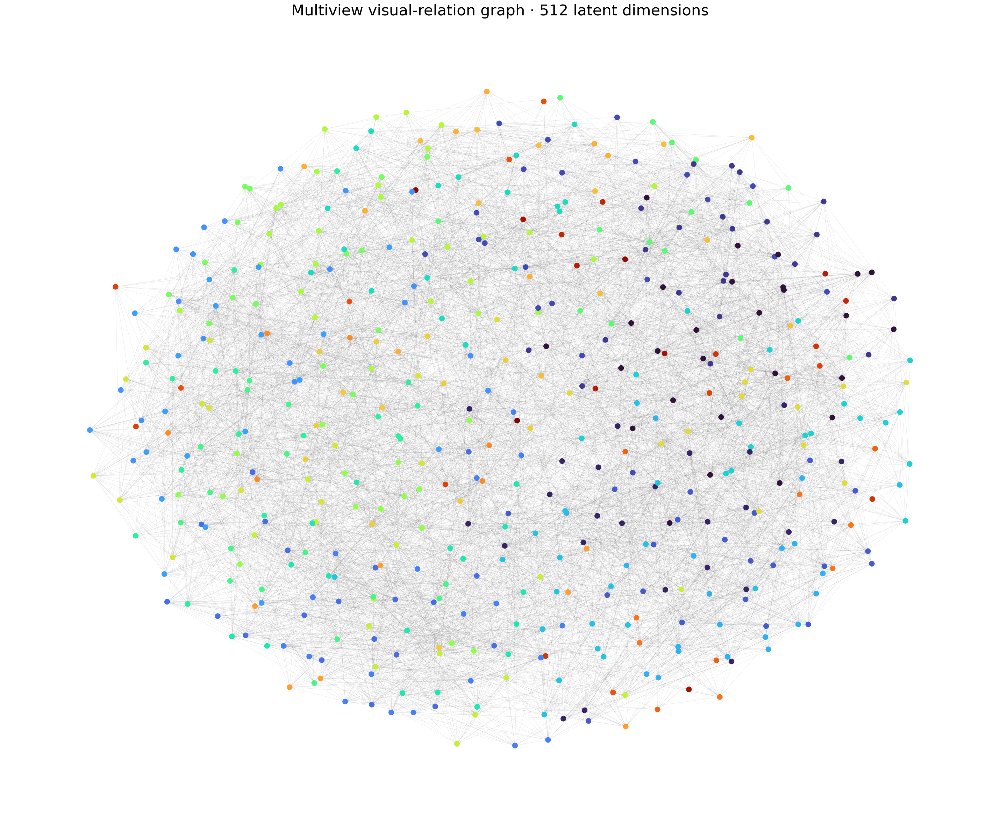
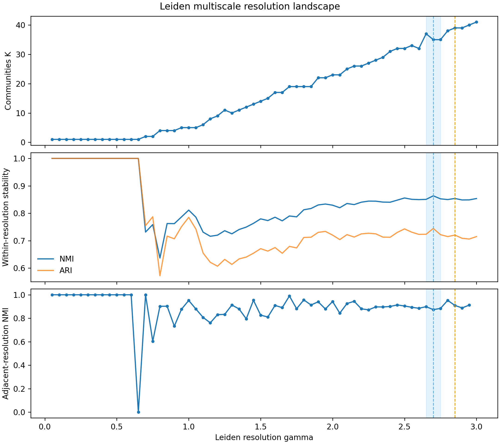
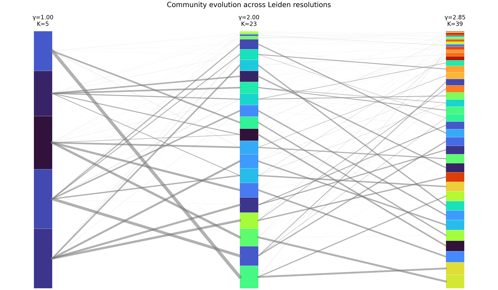
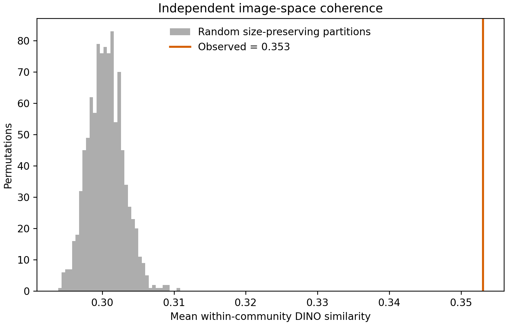
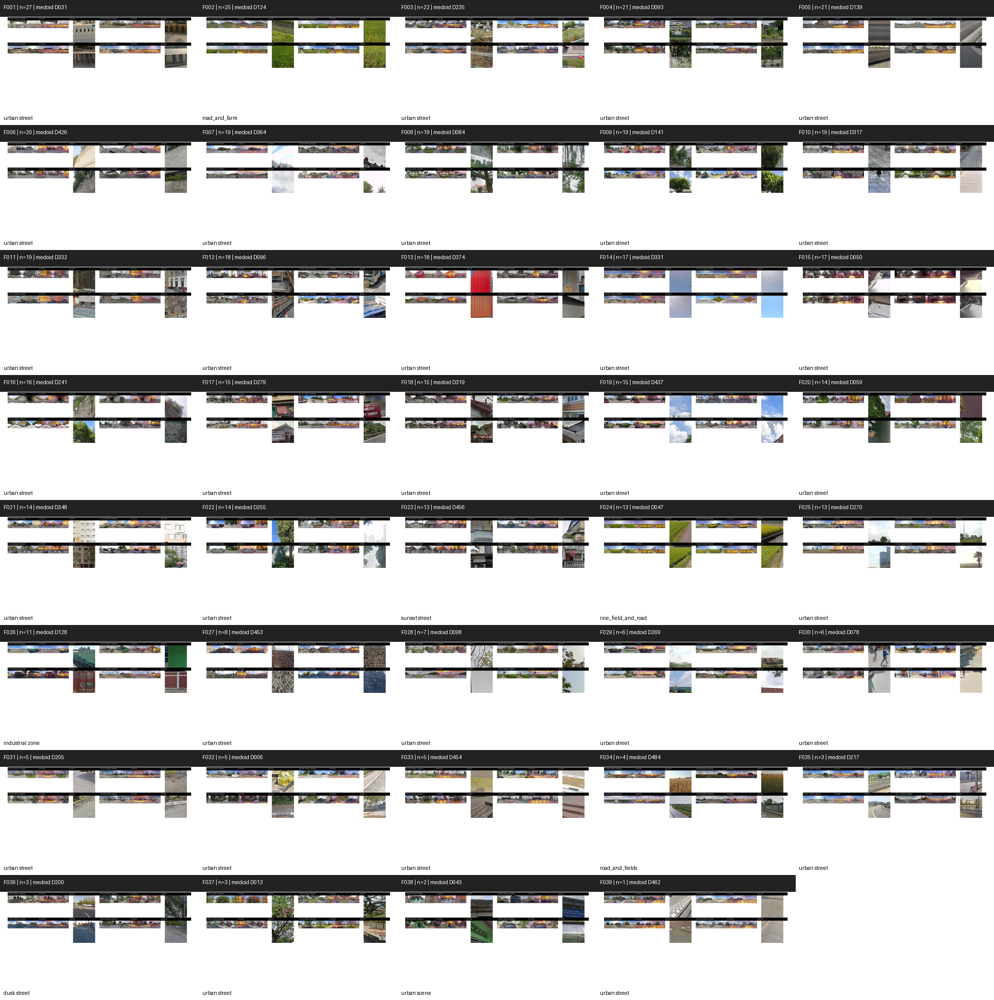
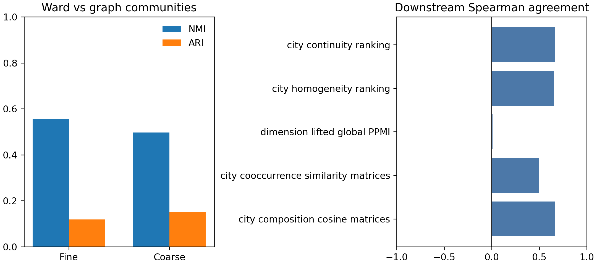

# Chapter 5 实验报告：基于多视图图社区发现的 Urban Visual Vocabulary

## 摘要

本实验将冻结 Feature-MAE 的 512 个 latent dimensions 视为视觉节点，分别利用 encoder direction、linearized decoder direction 和空间激活分布构建三个局部相似图，再通过等权融合和 Leiden community detection 寻找无需预设类别数量的城市视觉社区。

实验没有重新训练 DINOv3、Feature-MAE 或图像质量模型，也没有使用城市身份、城市流行率、元素共现关系或语义标签参与社区发现。所有语义解释均在社区划分完全固定后进行。

需要特别修正原研究计划中的输入定义：当前 pipeline 的分析单元已经不是单张独立方向影像，而是同一采样点四个方向联合处理后的完整街景全景。四张 640×640 图像拼接后缩放为 896×224，DINOv3 与 Feature-MAE 输出对应 `14×56×512` latent tensor。因此，本实验的空间激活 profile 使用 784 个环形全景位置，而不是原计划中的 196 个位置。

实验在 30 个城市、296,462 个完整全景、232,426,208 个 patches 上完成。融合后的 visual-relation graph 包含 512 个节点和 24,673 条边，并形成一个连通分量。Leiden resolution sweep 只发现一个满足稳定性要求的非平凡 plateau：γ=2.65–2.75，对应约 35–37 个社区。最终选取 γ=2.70、K=35 作为稳定主尺度；γ=2.85、K=39 仅作为探索性 fine scale，而不是第二个稳定尺度。

独立图像空间验证显示，fine communities 内部的平均 DINOv3 相似度为 0.3530，社区之间为 0.2989，差值为 0.0541，Cohen's d=0.414。保持社区大小不变的 1,000 次随机置换检验得到 p=0.000999，说明 graph communities 在未参与社区发现的图像证据中具有显著但中等强度的视觉一致性。

总体上，本实验支持以下较为谨慎的结论：Feature-MAE latent representation 中确实存在可以通过多视图关系图识别的稳定视觉组织结构，但当前结果只明确支持一个稳定的社区尺度，尚不足以宣称已经发现两个同等稳健的 coarse/fine 层级。

---

## 1. 研究问题

本实验检验以下问题：

> Feature-MAE 学到的 512 个 latent visual responses 是否能够在 representational 和 spatial relation graph 中形成稳定的视觉社区？这些社区是否存在多个稳定的组织尺度？

实验替换旧流程中的：

```text
rank fusion
→ spectral embedding
→ Ward clustering
→ 预先固定 32/64 类
```

改为：

```text
encoder / decoder / panorama-spatial views
→ independent local kNN graphs
→ local scaling and graph normalization
→ equal-weight graph fusion
→ multiseed Leiden resolution sweep
→ stability-based scale selection
```

整个实验遵守以下约束：

1. 不使用 city identity 构图；
2. 不使用 city prevalence 构图；
3. 不使用 PPMI 或共现关系定义社区；
4. 不使用语义标签定义社区；
5. 不为获得 32 或 64 类而调节 γ；
6. 不人工合并、拆分或删除难解释的社区；
7. DINOv3 与 Feature-MAE 全程冻结。

---

## 2. 数据与输入修正

### 2.1 实际分析单元

每个分析样本为一个具有四个方向的完整街景采样点：

```text
4 × 640×640 directional views
→ 2560×640 stitched panorama
→ aspect-ratio-preserving resize to 896×224
→ DINOv3 14×56×768 tokens
→ frozen Feature-MAE 14×56×512 latent activations
```

因此，每个全景包含：

\[
14\times56=784
\]

个 patch positions。

原计划中的 `14×14×512` 和 `P.shape=(512,196)` 已修正为：

```text
latent activation: N × 14 × 56 × 512
spatial profile P: 512 × 784
```

这种处理保留了四方向联合推理后横向连续的全景 latent structure，避免重新将四个方向错误地当成独立样本。

### 2.2 数据规模

| 项目 | 数量 |
|---|---:|
| 城市 | 30 |
| 完整四方向全景 | 296,462 |
| 每个全景 patches | 784 |
| 总 patches | 232,426,208 |
| latent dimensions | 512 |
| encoder/decoder direction 维度 | 768 |

共有 11 个 latent dimensions 从未成为任何 patch 的 Top-1 winner：

```text
D026, D043, D071, D076, D087, D134,
D367, D402, D475, D484, D493
```

这些维度没有被删除。它们的空间 profile 记为零，但仍由 encoder 和 decoder views 提供图关系。

---

## 3. 方法

### 3.1 三个独立视图

对每个 latent dimension 构建：

- Encoder view：`E.shape=(512,768)`；
- Decoder view：`D.shape=(512,768)`；
- Panorama spatial view：`P.shape=(512,784)`。

三组向量分别进行 row-wise L2 normalization，并计算 cosine similarity。三组向量没有直接拼接。

### 3.2 局部图与 local scaling

每个 view 使用 `k=30` 的 symmetric kNN union graph。边权使用：

\[
W_{ij}^{(v)}=
\exp\left[-\frac{(1-S_{ij}^{(v)})^2}{\sigma_i\sigma_j+10^{-12}}\right],
\]

其中 \(\sigma_i\) 为节点 \(i\) 到第 30 个近邻的 cosine distance。

每个 view 的非零边权再除以该 view 的平均非零边权，最后等权融合：

\[
W=\frac{\bar W_E+\bar W_D+\bar W_P}{3}.
\]

### 3.3 Leiden resolution sweep

首先运行预注册范围：

```text
γ = 0.10, 0.15, ..., 2.00
```

由于 γ=2.00 时社区数量仍持续上升，尚未覆盖完整的合理结构范围，因此按照计划自动扩展为：

```text
γ = 0.05, 0.10, ..., 3.00
```

共 60 个 resolution。每个 γ 使用随机种子 0–19 重复 20 次。每个 resolution 的 representative partition 不是最大 modularity 单次运行，而是与其余 19 次运行平均 NMI 最高的 medoid partition。

### 3.4 Plateau 判断

候选 plateau 需要连续至少三个 γ 点，并满足：

- mean seed NMI 不低于阈值；
- adjacent-resolution NMI 不低于阈值；
- 区间内 `max(K)-min(K)≤2`；
- 排除 K=1 的平凡稳定分区。

阈值按照计划从 0.90 依次放宽到 0.85 和 0.80。本实验在 0.90 时没有找到 plateau，在 0.85 时找到候选区域，因此实际使用阈值为 0.85。

---

## 4. Visual-relation graph 结果

### 4.1 各视图图统计

| Graph | Edges | Density | Components | Degree min/mean/max |
|---|---:|---:|---:|---:|
| Encoder \(G_E\) | 8,515 | 0.0651 | 1 | 30 / 33.26 / 52 |
| Decoder \(G_D\) | 8,474 | 0.0648 | 1 | 30 / 33.10 / 46 |
| Spatial \(G_P\) | 9,627 | 0.0736 | 12 | 0 / 37.61 / 78 |
| Fused \(G\) | 24,673 | 0.1886 | 1 | 58 / 96.38 / 133 |

Spatial graph 的 12 个 connected components 来源于一个主要分量与 11 个从未成为 Top-1 winner 的零空间 profile 节点。这不是通过人工补边修复的；融合 E、D、P 后，512 个节点自然形成一个 connected component。

融合图可视化见：



---

## 5. Resolution stability 与尺度选择

### 5.1 稳定区域

实验只发现一个符合规则的非平凡稳定区间：

| 指标 | 结果 |
|---|---:|
| γ 范围 | 2.65–2.75 |
| 连续点数 | 3 |
| K 范围 | 35–37 |
| mean seed NMI | 0.8556 |
| mean adjacent-resolution NMI | 0.8860 |
| 实际稳定性阈值 | 0.85 |

在 plateau 中选取 γ=2.70、K=35 作为稳定主尺度。

### 5.2 探索性 fine scale

没有发现第二个更高 resolution 的强稳定 plateau。因此，本实验没有人为制造第二个稳定尺度，而是选择 seed stability 较好的 γ=2.85、K=39 作为探索性 secondary/fine partition。

最终尺度定义为：

```text
Stable primary/coarse scale:
γ = 2.70, K = 35

Exploratory secondary/fine scale:
γ = 2.85, K = 39
```

需要强调：K=35 和 K=39 均不是预先指定的数值，但只有 K=35 所在区域满足当前 plateau 规则。当前证据不能写成“识别出了两个同等稳定的尺度”。



社区随 resolution 的非严格嵌套演化见：



---

## 6. Community structure

### 6.1 社区规模

探索性 fine partition 包含 39 个 communities，规模从 1 到 27 个 dimensions：

```text
27, 25, 22, 21, 21, 20,
19, 19, 19, 19, 19,
18, 18, 17, 17, 16,
15, 15, 15,
14, 14, 14,
13, 13, 13,
11, 8, 7, 6, 6,
5, 5, 5, 4,
3, 3, 3, 2, 1
```

最大的社区为 F001，包含 27 个 dimensions，medoid 为 D031；最小的 F039 只有 D462 一个节点。

### 6.2 Coarse/fine association

两个 resolution 的分区没有被强制变成严格树结构。fine community 与 coarse community 的主要关联使用最大 Jaccard overlap 确定。

结果显示：

- mean fine-to-coarse purity：0.843；
- median purity：0.955；
- minimum purity：0.167；
- 整体不是严格嵌套结构。

因此，更准确的表述是 `multiscale community structure`，而不是严格的 hierarchical taxonomy。

### 6.3 Graph coherence 的限制

多数社区的 conductance 较高，尤其是小型社区。这与 fused graph 的密度较高以及 union-kNN 保留三个 view 的边有关。社区在统计上存在，但边界并不是完全隔离的模块。因此，本实验不应把各社区解释为彼此排斥的硬语义类别，而应理解为 latent response network 中相对聚集的视觉模式。

---

## 7. 独立视觉一致性验证

每个 latent dimension 取其 Top-10 activated panorama crops，使用冻结 DINOv3 提取独立图像 embedding。该 embedding 完全不参与 graph construction 或 community discovery。

验证结果：

| 指标 | 数值 |
|---|---:|
| Mean within-community similarity | 0.3530 |
| Mean between-community similarity | 0.2989 |
| Difference | 0.0541 |
| Cohen's d | 0.4141 |
| Permutations | 1,000 |
| Permutation p-value | 0.000999 |

真实社区的内部图像相似度显著高于保持社区大小不变的随机分组。这说明 graph communities 不只是 E、D、P 数值空间中的结构，也在独立真实视觉 evidence 中表现出一致性。

同时，效应量约为 0.41，属于中等而非极强效应。这与部分 communities 包含多种街景内容以及社区 conductance 偏高的结果一致。



---

## 8. Post-hoc semantic interpretation

在所有分区完全固定后，对 39 个 fine communities 构建 evidence sheets。每张 sheet 包含：

- 四方向联合原始全景；
- community member dimension 的激活叠加；
- 最大激活 patch crop；
- source latent dimension。

随后使用 Qwen3-VL-2B-Instruct 进行 post-hoc 命名。语义结果没有进入图构建或 Leiden 社区发现。

模型能够较明确识别少数社区，例如：

- F002：道路与农田；
- F023：日落街景；
- F024：稻田与道路；
- F026：工业区；
- F034：道路与田野；
- F036：黄昏街景。

但是，大量社区被保守地命名为“城市街景”，并且模型给出的 confidence 普遍偏低。这说明当前 community-level evidence 虽然在图像 embedding 上具有统计一致性，但未必对应单一、容易用自然语言概括的对象语义。它们可能表达材质、局部几何、空间位置、光照、上下文组合或多个相关响应，而不是传统 semantic segmentation 类别。

因此，当前 Qwen 标签只能作为检索和人工检查的辅助信息，不应直接用作最终 taxonomy 名称或社区有效性的主要证据。



每个社区的完整 evidence sheet 位于：

```text
paper/figures/graph_visual_vocabulary/community_evidence/
```

---

## 9. 城市视觉组成

将每个全景的 784 个 patch winners 从 latent dimension 映射到 39 个 fine communities，得到城市视觉组成。

主要结果：

- 39 个 communities 中有 36 个在全部 30 个城市中出现；
- 三个未在所有城市出现的 communities 均属于极低 prevalence 的小社区；
- 全部 city-community prevalence 范围为 0–0.1897；
- 城市之间组成 cosine similarity 整体较高，说明各城市主要共享同一套 latent visual vocabulary，但表达比例不同。

最相似和最不相似的城市对为：

| 类型 | 城市对 | Cosine similarity |
|---|---|---:|
| 最高 | Jakarta–Manila | 0.997 |
| 最低 | Dhaka–Osaka | 0.893 |

视觉组成 entropy：

- 较低：Amsterdam、London、Mumbai、Toronto、Los Angeles；
- 较高：Buenos Aires、Johannesburg、Mexico City、Seoul、Bangkok。

这里的 entropy 反映 community prevalence 的均匀程度，不等价于主观意义上的城市“视觉丰富度”。

---

## 10. Community co-occurrence

共现分析完全沿用旧实验的定义：

- 每个全景选择 patch count 最高的 Top-8 communities；
- 全局最低 pair support 为 `max(100, ceil(0.0005N))=149`；
- PPMI 使用原有的 observed/expected 加 0.5 平滑定义；
- 不使用共现结果反向定义 visual communities。

全局共得到 104 条正且满足 support threshold 的 community pairs。PPMI 最高的组合为：

| Rank | Pair | Panorama support | PPMI |
|---:|---|---:|---:|
| 1 | F009–F028 | 325 | 1.495 |
| 2 | F018–F028 | 926 | 1.230 |
| 3 | F013–F014 | 6,088 | 0.697 |
| 4 | F007–F028 | 564 | 0.681 |
| 5 | F008–F011 | 3,858 | 0.574 |

城市组成相似度与城市共现相似度的 city-pair Spearman correlation 为 0.457。这说明两个城市即使拥有相似的视觉元素比例，也不一定以相同方式组织这些视觉元素；composition 和 co-occurrence 捕捉的是不同层面的城市视觉结构。

---

## 11. 城市内部空间组织

空间分析复用原实验定义：

- grid sizes：500 m、1 km、2 km；
- 主分析：1 km grid；
- 每个 grid 至少 5 个 panoramas；
- 计算全局 grid homogeneity、相邻 grid continuity 和 community-level Moran's I；
- 共完成 30×39=1,170 个 Moran's I 检验。

主分析中，visual homogeneity 最高的城市包括：

| Rank | City | Homogeneity | Local continuity |
|---:|---|---:|---:|
| 1 | Singapore | 0.9734 | 0.9838 |
| 2 | Mumbai | 0.9711 | 0.9831 |
| 3 | Bogota | 0.9708 | 0.9842 |
| 4 | Lagos | 0.9665 | 0.9839 |
| 5 | Sao Paulo | 0.9654 | 0.9752 |

homogeneity 最低的城市包括 Dhaka、Moscow、Vienna、Paris 和 Seoul。local continuity 最高的是 Bogota，其次为 Lagos、Singapore、Mumbai 和 Cape Town。

这些数值应理解为当前 community representation 与 grid definition 下的相对描述，不能直接解释为城市规划质量或城市空间优劣。

---

## 12. 与旧 Ward partition 的比较

### 12.1 Partition agreement

| Comparison | NMI | ARI |
|---|---:|---:|
| Old Ward-64 vs new exploratory fine-39 | 0.557 | 0.119 |
| Old Ward-32 vs new stable primary-35 | 0.497 | 0.149 |

NMI 表明新旧分区保留了部分共有结构，但较低的 ARI 说明节点的具体分组发生了明显变化。新方法并不是旧 Ward taxonomy 的简单重现。

### 12.2 Downstream agreement

| Downstream comparison | Spearman ρ |
|---|---:|
| City composition similarity matrices | 0.667 |
| City co-occurrence similarity matrices | 0.494 |
| City homogeneity ranking | 0.653 |
| City continuity ranking | 0.664 |
| Dimension-lifted global PPMI | 0.009 |

城市组成与空间排序具有中等一致性，表明旧方法的一部分宏观城市差异在新 partition 下仍然存在。但 global PPMI 的 dimension-lifted correlation 接近零，意味着具体共现网络对 visual vocabulary 的划分方式非常敏感。

因此，不能简单声称新旧方法得出了相同的组合结构。更准确的结论是：宏观城市组成和空间排序具有一定稳健性，而具体 community co-occurrence edges 发生了实质性变化，需要在论文中如实报告。



---

## 13. 主要结论

### 13.1 Graph 是否形成明显 community structure？

是。三个独立视图融合后形成一个包含 512 个节点、24,673 条边的 connected graph。Leiden 在较高 γ 范围内产生非平凡且具有跨 seed 一致性的社区结构。

### 13.2 是否存在 stable resolution plateaus？

存在一个明确的非平凡 plateau：γ=2.65–2.75。当前扫描范围内没有发现第二个同等满足规则的稳定 plateau。

### 13.3 最终尺度是什么？

- 稳定主尺度：γ=2.70，K=35；
- 探索性 fine scale：γ=2.85，K=39。

这些数量来自 resolution stability，而不是事先指定。

### 13.4 图像证据是否支持 community coherence？

支持。社区内部 DINOv3 相似度显著高于社区之间以及随机分组，但效应量为中等水平，说明社区具有真实视觉一致性，同时仍保留一定内部异质性。

### 13.5 是否支持“shared urban visual vocabulary”？

初步支持。36/39 个 fine communities 出现在全部 30 个城市中，城市之间 composition similarity 较高；城市差异主要表现为相同视觉社区的不同 prevalence、不同共现组合和不同空间组织。

### 13.6 最终科学表述

当前结果支持：

> The frozen Feature-MAE representation contains a structured network of related latent visual responses, from which a stable visual community scale emerges without prescribing the number of categories in advance.

还可以支持：

> Cities largely draw upon a shared latent visual vocabulary, while differing in the prevalence, co-occurrence, and spatial organization of its constituent visual communities.

但当前不宜写成：

> Two equally stable coarse and fine taxonomic levels were discovered.

因为本实验只发现一个强稳定 plateau，K=39 仍是探索性辅助尺度。

---

## 14. 局限性与下一步

1. **只有一个强稳定尺度。** 当前证据支持稳定社区结构，但不足以确认两个独立稳定的组织层级。
2. **Fine scale 是探索性的。** 下游分析使用 K=39 是为了保留更细粒度解释能力，不应将其稳定性与 K=35 等同。
3. **部分社区规模很小。** K=39 中包含一个 singleton 和多个 2–5 节点社区，需要在后续 robustness 分析中检查其稳定性。
4. **社区 conductance 较高。** 融合图较密，社区边界不是完全隔离的硬分类。
5. **Qwen 语义标签区分度有限。** 多数社区被概括为一般城市街景，说明自动命名还不能替代人工视觉审查。
6. **PPMI 网络对 partition 敏感。** 新旧 global PPMI 一致性很低，共现层面的科学结论需要基于新 partition 重新解释。
7. **尚未进行扩展稳健性实验。** 本轮严格按第一版计划，没有增加不同 k、不同融合权重、mutual-kNN 或额外 resolution seed robustness。

后续最有价值的工作是：

- 对 K=35 稳定主尺度和 K=39 探索性尺度分别进行人工 evidence review；
- 检查小社区在不同 kNN 参数和 fusion weights 下能否复现；
- 改进 community evidence 排版和 VLM prompt，使对象、材质、纹理、几何与空间位置更容易区分；
- 对新 PPMI 网络进行单独的视觉组合解释，而不是沿用旧 Ward 类别的解释。

---

## 15. 输出与复现

### 15.1 论文数据

```text
paper/data/graph_visual_vocabulary/
├── graph/
├── leiden/
├── validation/
├── downstream/
├── semantic/
├── config.yaml
├── input_audit.json
└── report.md
```

### 15.2 论文图片

```text
paper/figures/graph_visual_vocabulary/
├── graph_overview.png
├── resolution_landscape.png
├── community_evolution.png
├── visual_vocabulary.png
├── visual_coherence.png
├── old_vs_new.png
└── community_evidence/
```

### 15.3 大型中间结果

```text
outputs/experiments/dinov3_multicity/graph_visual_vocabulary/
```

该目录保存 similarity matrices、sparse graphs、全部 Leiden partitions、panorama-level community counts 和 DINO validation embeddings，避免将大数组混入论文目录。

### 15.4 一键运行

```bash
taskset -c 0-7 python3 -m \
  scripts.multicity.graph_visual_vocabulary.run_all \
  --config configs/graph_visual_vocabulary.yaml
```

各阶段支持已有输出跳过；需要强制重算时使用 `--force`。Qwen3-VL 阶段自动使用配置中指定的独立 Python 环境，避免与 DINO/scipy 依赖发生冲突。

---

## 16. 最终判断

本实验已经完成研究计划要求的完整技术链：

```text
four-direction panorama Feature-MAE activations
→ encoder / decoder / panorama-spatial graphs
→ local scaling and equal-weight fusion
→ multiseed Leiden resolution sweep
→ stable-scale selection
→ community diagnostics and evidence sheets
→ independent DINO visual validation
→ post-hoc semantic interpretation
→ city composition, co-occurrence and spatial analyses
→ comparison with the previous Ward partition
```

实验结果对核心问题给出了肯定但有限定条件的回答：Feature-MAE latent responses 能够形成显著且可复现的 visual communities，并且这些 communities 在独立图像空间中具有统计显著的视觉一致性；但当前只发现一个明确稳定尺度，细粒度 vocabulary 仍需要进一步稳健性和人工语义审查。
