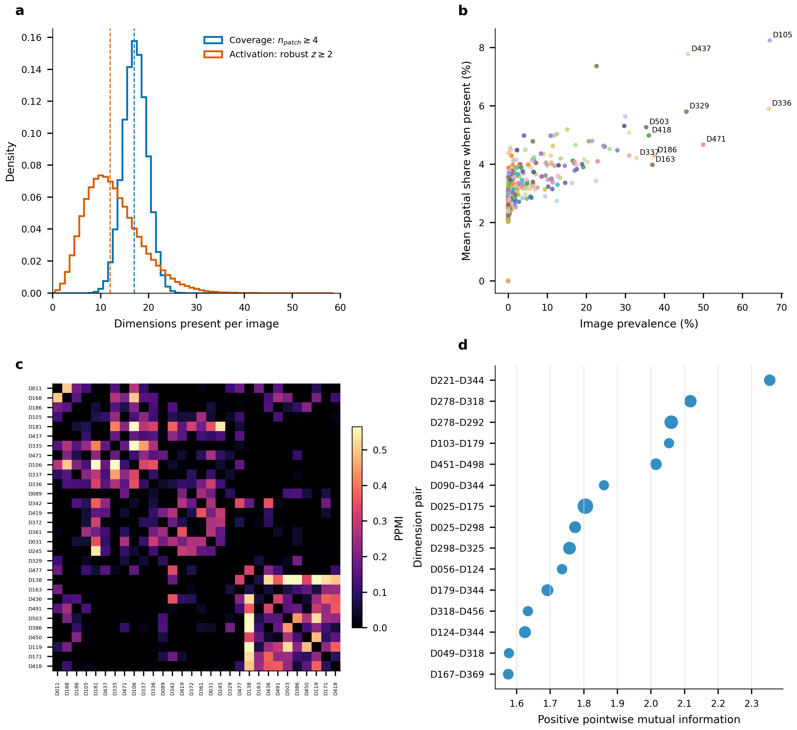
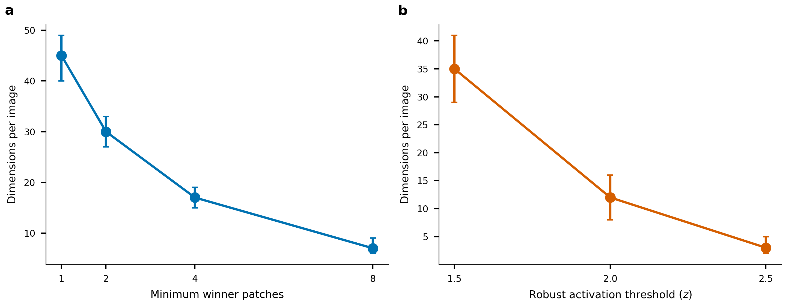
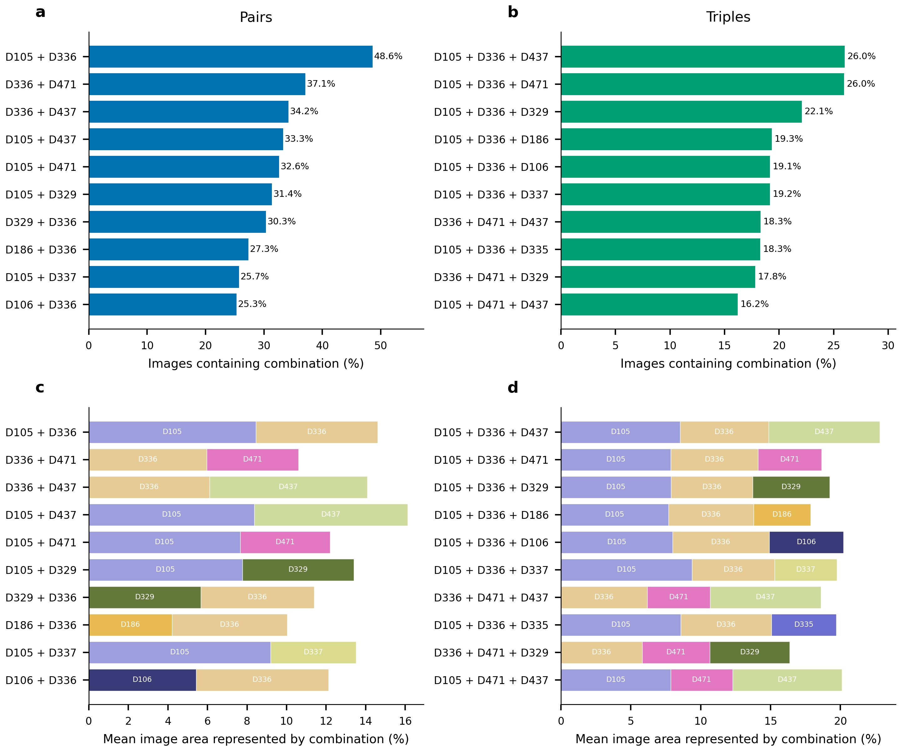

# 单图 Feature-MAE 维度空间占比数据说明

## 1. 数据用途

本目录保存每张街景图像中 512 个 Feature-MAE 潜在维度的空间占比，用于回答以下问题：

- 一张街景图像通常同时包含多少个潜在维度？
- 哪些维度在图像中最常出现？
- 每个维度通常覆盖多大的图像区域？
- 哪些维度经常在同一张图像中共同出现？
- 不同城市的维度组成是否存在系统差异？

核心数据文件为：

```text
image_dimension_pixel_proportions.parquet
```

该文件包含质控后全部 30 个城市、378,818 张方向图像。每行对应一张图像，每列 `D000`--`D511` 对应一个 Feature-MAE 潜在维度。

---

## 2. 数据生成流程

每张图像首先缩放到 $224\times224$，并由冻结的 DINOv3 ViT-B/16 编码为 $14\times14$ 个 patch：

```text
image
-> 224 x 224 input
-> 14 x 14 patch grid
-> 196 DINOv3 patch tokens
-> Feature-MAE encoder
-> 196 x 512 latent activation tensor
```

记图像 $i$、patch $p$、潜在维度 $d$ 的激活为：

$$
A_i(p,d), \qquad p\in\{1,\ldots,196\},\quad d\in\{1,\ldots,512\}.
$$

对于每个 patch，选择激活值最高的维度：

$$
d^*_{ip}=\arg\max_d A_i(p,d).
$$

维度 $d$ 在图像 $i$ 中主导的 patch 数量为：

$$
n_{id}=\sum_{p=1}^{196}\mathbb{1}(d^*_{ip}=d).
$$

最终空间占比定义为：

$$
q_{id}=\frac{n_{id}}{196}.
$$

因此，对任意图像均有：

$$
0\le q_{id}\le1,
\qquad
\sum_{d=1}^{512}q_{id}=1.
$$

表格中的 `D000`--`D511` 就是 $q_{id}$。例如：

```text
D105 = 0.07653
```

表示 D105 在该图像中主导 15 个 patch：

$$
15/196\approx0.07653=7.653\%.
$$

---

## 3. “像素占比”的准确含义

这里的比例严格来说是 **patch-level spatial share**，即 patch 网格上的空间面积占比，而不是在原始分辨率图像上逐像素进行语义分割。

DINOv3 ViT-B/16 的输入为 $224\times224$，每个 patch 对应 $16\times16$ 输入像素。由于所有 196 个 patch 面积相同，patch 数量比例等价于缩放后模型输入上的离散像素面积比例。

因此该指标适合解释为：

> 某个潜在维度在模型输入空间中占据的近似图像面积。

其最小非零单位为：

$$
1/196\approx0.005102=0.5102\%.
$$

不应将该指标解释为原始街景图像上的精确像素分割面积。

---

## 4. 表格规模

```text
Images:             378,818
Cities:             30
Metadata columns:   15
Dimension columns:  512
Total columns:      527
Patches per image:  196
Value scale:        0--1
File format:        Parquet with Zstandard compression
File size:          approximately 59 MB
```

原始数据集包含 384,000 张方向图像。质量控制去除了 5,182 张伪影、隧道、黑屏、模糊或不可读取图像，因此本表覆盖最终有效训练集中的全部 378,818 张图像。

### 4.1 真实数据前五行（部分维度）

下面直接展示 Parquet 文件的前五行。为避免表格过宽，只列出元数据和 512 个维度中的 6 列；文件中其余维度仍完整保存。数值为原始的 0--1 空间占比，而不是百分数。

| `global_image_index` | `city_key` | `heading` | `D061` | `D105` | `D336` | `D418` | `D449` | `D503` |
|---:|---|---:|---:|---:|---:|---:|---:|---:|
| 0 | Argentina/BuenosAires | 180 | 0.035714 | 0.076531 | 0.030612 | 0.086735 | 0.122449 | 0.000000 |
| 1 | Argentina/BuenosAires | 180 | 0.000000 | 0.214286 | 0.025510 | 0.020408 | 0.005102 | 0.051020 |
| 2 | Argentina/BuenosAires | 180 | 0.000000 | 0.076531 | 0.010204 | 0.000000 | 0.020408 | 0.086735 |
| 3 | Argentina/BuenosAires | 90 | 0.005102 | 0.045918 | 0.035714 | 0.020408 | 0.000000 | 0.025510 |
| 4 | Argentina/BuenosAires | 180 | 0.000000 | 0.204082 | 0.015306 | 0.000000 | 0.000000 | 0.000000 |

例如，第一行中的 `D449 = 0.122449`，表示 D449 主导该图像 196 个 patch 中的 24 个，即 $24/196=12.2449\%$。表中没有展示的维度不能视为零；这只是完整 512 维宽表的横向截取。

### 4.2 前五张图像的主要维度

下表从同一批真实行中选出空间占比最高的维度。`非零维度数`统计至少主导一个 patch 的维度，`512维之和`用于检查每张图是否完整分配了全部 196 个 patch。

| 图像索引 | 航向 | 非零维度数 | 512维之和 | 空间占比最高的五个维度 |
|---:|---:|---:|---:|---|
| 0 | 180 | 48 | 1.000000 | D449 12.24%; D418 8.67%; D105 7.65%; D181 4.59%; D329 4.08% |
| 1 | 180 | 46 | 1.000000 | D105 21.43%; D386 9.18%; D426 6.12%; D491 5.61%; D503 5.10% |
| 2 | 180 | 46 | 1.000000 | D503 8.67%; D105 7.65%; D119 6.63%; D179 5.10%; D451 5.10% |
| 3 | 90 | 51 | 1.000000 | D450 11.22%; D011 5.61%; D430 5.61%; D233 4.59%; D105 4.59% |
| 4 | 180 | 45 | 1.000000 | D105 20.41%; D141 7.65%; D319 6.63%; D124 5.10%; D325 4.59% |

这几行说明数据不是给每张图指定单一类别，而是把 196 个空间 patch 分配到 512 个潜在维度，从而保留同一图像内部多个视觉维度共同存在及其面积比例。

---

## 5. 元数据字段

| 字段 | 含义 |
|---|---|
| `global_image_index` | 图像在 378,818 张全局数组中的行号 |
| `city_key` | 国家与城市标识 |
| `image_index` | 图像在质控后城市清单中的索引 |
| `source_image_index` | 图像在原始城市特征或图像存储中的索引 |
| `pano_index` | 全景点索引 |
| `panoid` | 街景全景唯一标识 |
| `direction_index` | 同一全景中的方向编号 |
| `heading` | nominal viewing direction，通常为 0、90、180 或 270 度 |
| `lat`, `lon` | 图像对应全景点的经纬度 |
| `year`, `month` | 街景采集时间；未知值以 -1 表示 |
| `tar_path` | 原始 JPEG 所在 TAR 包路径 |
| `jpg_offset`, `jpg_size` | JPEG 在 TAR 包中的偏移量和字节长度 |

维度列统一命名为：

```text
D000, D001, ..., D511
```

---

## 6. 如何读取

### 6.1 Python / pandas

```python
import pandas as pd

path = (
    "/workplace/urban_visual_gene/results/"
    "image_dimension_pixel_proportions.parquet"
)

df = pd.read_parquet(path)
dimension_columns = [f"D{i:03d}" for i in range(512)]
```

查看一张图像的最高占比维度：

```python
row = df.iloc[0]
top_dimensions = row[dimension_columns].sort_values(ascending=False).head(10)
print(top_dimensions * 100)
```

验证每张图像的512维占比之和：

```python
row_sums = df[dimension_columns].sum(axis=1)
print(row_sums.min(), row_sums.max())
```

### 6.2 只读取需要的维度

宽表包含约 1.94 亿个维度单元格。分析少量维度时，不应读取全部512列：

```python
subset = pd.read_parquet(
    path,
    columns=["global_image_index", "city_key", "panoid", "heading",
             "D105", "D336", "D437"],
)
```

### 6.3 转换为百分比

```python
subset["D105_percent"] = subset["D105"] * 100
```

---

## 7. 单图维度出现的推荐定义

某个维度仅主导一个 patch 时，可能反映局部噪声或非常微小的视觉区域。主要分析将“出现”定义为：

$$
n_{id}\ge4,
$$

等价于：

$$
q_{id}\ge4/196\approx2.04\%.
$$

Python 示例：

```python
present = df[dimension_columns] >= (4 / 196)
number_of_dimensions = present.sum(axis=1)
```

全数据统计结果为：

| 最小主导 patch 数 | 每图平均维度数 | 中位数 | 5%--95%范围 |
|---:|---:|---:|---:|
| 1 | 44.4 | 45 | 33--55 |
| 2 | 30.0 | 30 | 23--37 |
| 4 | 17.2 | 17 | 13--21 |
| 8 | 7.4 | 7 | 5--10 |

因此，单张街景图像通常由多个潜在维度共同构成，而不是只对应一个视觉类别。

---

## 8. 可进行的分析

### 8.1 单图视觉复杂度

可以统计一张图像中超过指定覆盖阈值的维度数量，或计算维度空间构成熵：

$$
H_i=-\sum_d q_{id}\log q_{id}.
$$

维度数量或熵越高，表示图像由更多不同的局部视觉响应共同构成。

### 8.2 维度总体出现率

维度 $d$ 的出现率可定义为：

$$
P(d)=\frac{1}{N}\sum_i\mathbb{1}(q_{id}\ge4/196).
$$

城市间样本数不完全相同时，应先在各城市内部计算出现率，再对30个城市等权平均。

### 8.3 维度共同出现

对两个维度 $a$ 和 $b$：

$$
P(a,b)=\frac{1}{N}\sum_i
\mathbb{1}(q_{ia}\ge4/196)\mathbb{1}(q_{ib}\ge4/196).
$$

随后可以计算 Jaccard、条件概率、Lift、PMI 或 PPMI。解释 PMI 时必须设置最低共同出现支持度，避免罕见组合产生异常高值。

### 8.4 城市视觉组成

按城市聚合每个维度的平均空间占比：

```python
city_profiles = df.groupby("city_key")[dimension_columns].mean()
```

这可以用于城市相似性、视觉多样性和空间异质性分析。

### 8.5 全景尺度分析

当前表的一行表示一个方向图像，而不是完整全景。若需要全景尺度分析，应按 `panoid` 聚合四个方向。可根据问题选择：

- `mean`：四个方向的平均视觉构成；
- `max`：只要任一方向出现就认为全景包含该维度；
- `sum` 后归一化：将四个方向视作一个环视视觉场。

### 8.6 已生成的统计图表

#### 单图维度数量、出现率与共存关系



图中：**a** 比较空间覆盖定义（至少主导 4 个 patch）与稳健激活定义下每张图包含的维度数；**b** 比较各维度在数据集中的图像出现率与出现时的平均空间占比；**c** 展示高频维度之间的 PPMI 共存结构；**d** 展示支持度过滤后关联最强的维度对。该图用于同时回答“一张图有多少维度”“每个维度多常见”和“哪些维度倾向共同出现”。

#### 出现阈值敏感性



图 **a** 显示最低主导 patch 数从 1 提高至 8 时，每张图的维度数量如何变化；图 **b** 显示采用稳健激活阈值时的对应变化。这说明“每张图包含多少维度”取决于出现定义，因此主分析采用 4 个 patch（约 2.04% 图像面积），并同时报告其他阈值作为敏感性分析。

#### 最普遍的维度组合



图 **a--b** 分别给出训练集中出现率最高的维度对和三维组合；图 **c--d** 给出这些组合在出现时覆盖的平均图像面积。上半部分回答组合“出现得多不多”，下半部分回答组合“共同覆盖多大区域”。组合统计使用相同的 $q_{id}\ge4/196$ 出现标准，覆盖质控后的全部 378,818 张图像。

---

## 9. 与完整激活强度的区别

本表使用每个 patch 的最高响应维度，因此反映的是 **相对空间主导关系**。它不等同于维度的绝对激活强度。

一个维度可能：

- 在许多 patch 中略强于其他维度，因此空间占比较高；
- 只在少数 patch 中产生很强响应，因此空间占比较低但激活强度较高。

完整的图像级激活缓存位于：

```text
outputs/analysis/all_city_umap_activation/image_activations.npy
```

其每个分数是某个维度在196个 patch 中最高20个激活的平均值。论文分析中建议将空间覆盖比例作为主指标，将稳健标准化后的激活强度作为交叉验证指标。

---

## 10. 与64类和32类层级的区别

本表的512列对应原始 Feature-MAE 潜在维度。它们随后根据编码器方向、解码器方向和空间激活模式被组织为：

```text
512 latent dimensions
-> 64 fine visual patterns
-> 32 coarse visual families
```

因此：

- `D000`--`D511`：最细粒度的模型潜在维度；
- `F000`--`F063`：由多个相似维度组成的细粒度视觉模式；
- `C000`--`C031`：更高层级的粗粒度视觉家族。

维度到 F/C 层级的映射保存在：

```text
results/cluster_membership.csv
```

语义名称仅在统计层级冻结后由视觉语言模型生成，不参与维度激活、空间占比、相似性或聚类计算。

---

## 11. 数据校验与可复现性

导出过程完成了以下检查：

- 清单行数与特征行数均为 378,818；
- 每张图像恰好包含 196 个 patch；
- 所有维度比例均位于 $[0,1]$；
- 每行 `D000`--`D511` 之和为 1；
- 抽样行和的最大浮点误差为 $3.58\times10^{-7}$；
- 城市顺序和图像顺序与质控后 manifest 保持一致。

导出脚本：

```text
scripts/multicity/export_image_dimension_pixel_proportions.py
```

运行报告：

```text
results/image_dimension_pixel_proportions.report.json
```

为了避免 CPU 8 和 CPU 9，推荐运行命令为：

```bash
taskset -c 0-7,10-15 \
  python3 -m scripts.multicity.export_image_dimension_pixel_proportions
```
