# Chapter 5 主要结果简报

> 来源：`/root/code/HKUST-Thesis/05_research3.tex`。本简报区分论文当前正式结果和仓库中后续完成的字典规模补充实验。

## 一句话结论

街景图像中的城市视觉结构并不是由彼此排斥的“城市专属元素”组成，而是由一套跨城市重复出现的视觉模式构成。城市之间的差异主要来自这些共享模式的相对比例、组合方式和空间组织，而不是来自完全独有的视觉元素。

## 研究问题

Chapter 5 主要回答四个问题：

1. 能否从高维街景表征中发现跨城市重复出现的视觉模式？
2. 这些模式是否具有可重复性，而不是某次训练或某个 feature index 的偶然结果？
3. 共享视觉模式的不同表达能否形成具有地理差异的 urban visual genome？
4. 这些模式是否保留与城市形态和地理环境相关的信息？

## 方法概览

- 使用冻结的 DINOv3 ViT-L/16 提取 `448 x 448` 街景图像的 `28 x 28 x 1024` patch 表征。
- 每个采样点的四个方向分别输入 DINOv3，然后在四个方向的 patch 网格上做环形 panorama context mixing；没有把四张图片直接拼成 `4096` 维向量。
- 使用 BatchTopK SAE，正式论文设置为字典宽度 `W=1024`、批级稀疏预算 `k=8`。
- SAE 输入是经过四视角空间 context 处理的 `1024` 维 patch 表征，训练采用 cosine reconstruction loss。
- SAE latent 先通过 encoder、decoder 和空间激活三个视角整合成层次结构，再在 fine resolution 划分为 64 个 visual-gene categories。
- 城市标签和语义描述没有进入 SAE 训练或 feature discovery，而是在后续分析阶段使用。

## 论文正式结果

### 1. 学到了共享且有层次的视觉词汇

30 个城市共纳入 `296,462` 个目标 panorama，排除 53 个失败 inference 记录后，最终城市分析使用 `296,409` 个四视角 panorama。DINOv3 patch 表征在城市之间存在大量重叠，同时也有局部位移，说明输入空间同时包含跨城市共性和地理差异。

1024 个 SAE latent 的 encoder、decoder 和空间激活具有系统关系。层次聚类在 16 到 128 个类别的不同 cut 上进行，论文将 64 类作为主要 fine-resolution 视觉词汇，较粗层级用于描述更宽泛的 visual families。

[查看 DINOv3 patch 表征的城市间 UMAP](figures/chapter5/chapter5_umap.pdf)

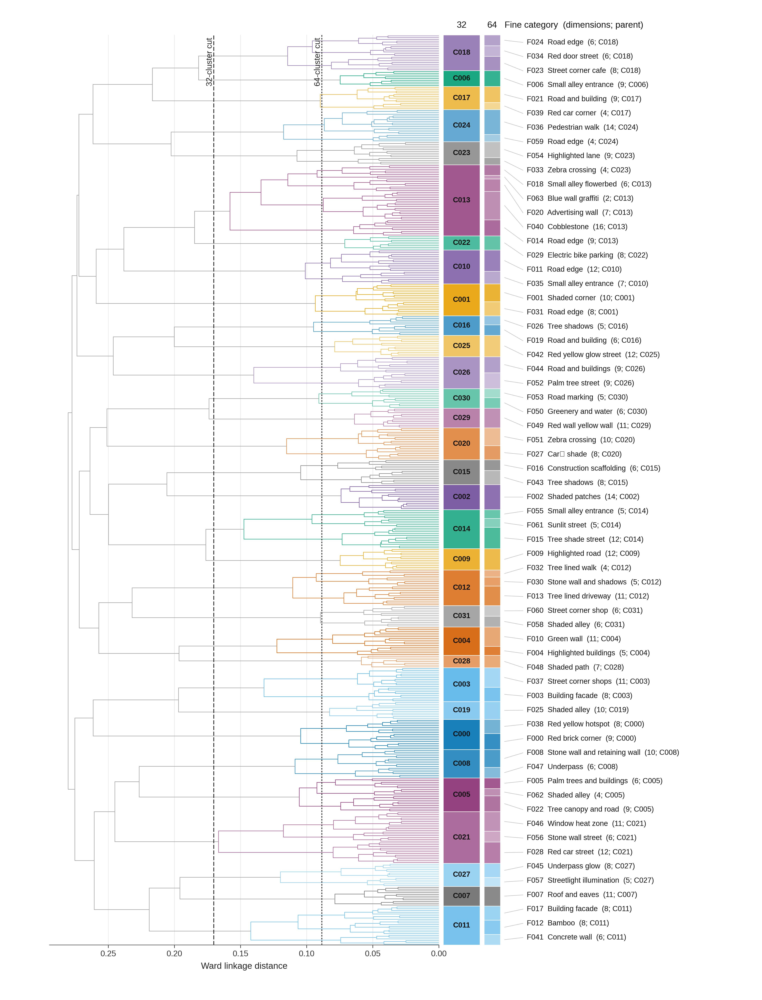

### 2. 大多数视觉响应来自跨城市共享模式

在 64 个 visual genes 中，按照论文的操作性阈值，32 个被定义为 broadly shared：

- 至少在 27/30 个城市中出现；
- 至少在 10% 的 panorama 中占据 1% 以上 patch assignment；
- equal-city mean response share 至少为 0.5%。

这 32 个 shared genes 合计解释 `93.94%` 的 equal-city mean response share。改变 patch-share 和 city-coverage 阈值后，共享 gene 数量为 `18--34`，合计响应份额为 `80.22%--95.13%`，总体结论保持一致。

### 3. 城市差异主要是共享词汇的不同表达

城市 visual profiles 之间的 compositional overlap 为 `80.05%--92.51%`。这说明城市之间总体共享同一套视觉词汇，但不同城市会对其中一部分模式产生相对富集或相对缺失。

论文中的例子：

- Hong Kong 的 F008（post-hoc interpreted as stone wall / retaining wall）响应份额为 `5.61%`，其他城市参考均值为 `3.49%`，相对富集 `2.12` 个百分点。
- Vienna 的 F040（post-hoc interpreted as cobblestone）响应份额为 `5.64%`，其他城市参考均值为 `4.36%`，相对富集 `1.28` 个百分点。

因此，“城市独特性”不等于“城市专属 feature”；共享模式的比例变化本身就足以形成地方视觉特征。

[查看共享与城市差异 visual genes 原图](figures/chapter5/shared_distinctive.pdf)

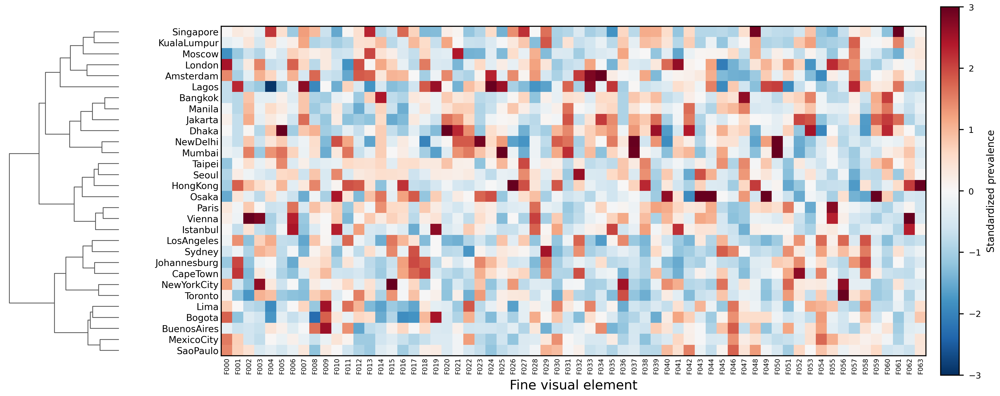

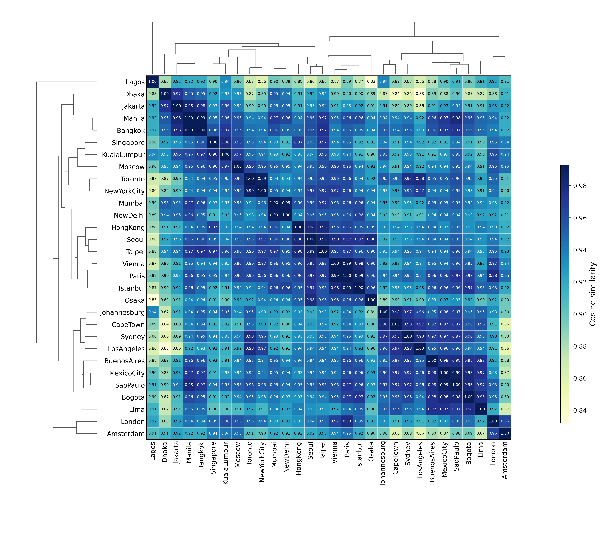

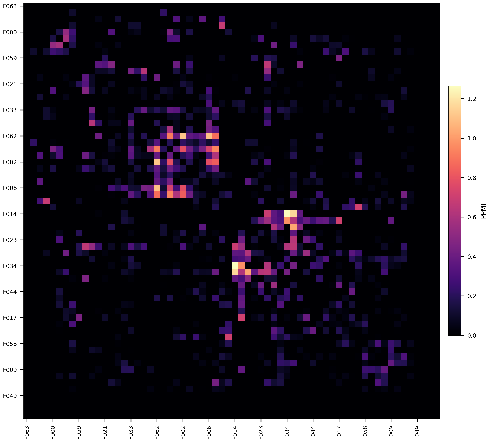

### 4. 视觉结构在城市内部也具有空间组织

在 `1 km x 1 km` 网格上，同一城市不同区域的 visual-gene composition 并不均匀。论文区分了：

- global visual homogeneity：城市整体网格之间的相似程度；
- local visual continuity：相邻网格之间的相似程度。

两者并不等价：城市可以整体差异较大，但局部街区仍然连续；也可以整体较均一，但邻接区域出现较强碎片化。500 m 和 2 km 的分辨率敏感性分析，以及 Moran's I 的多重检验结果，支持这种空间组织并非单一网格尺度的偶然现象。

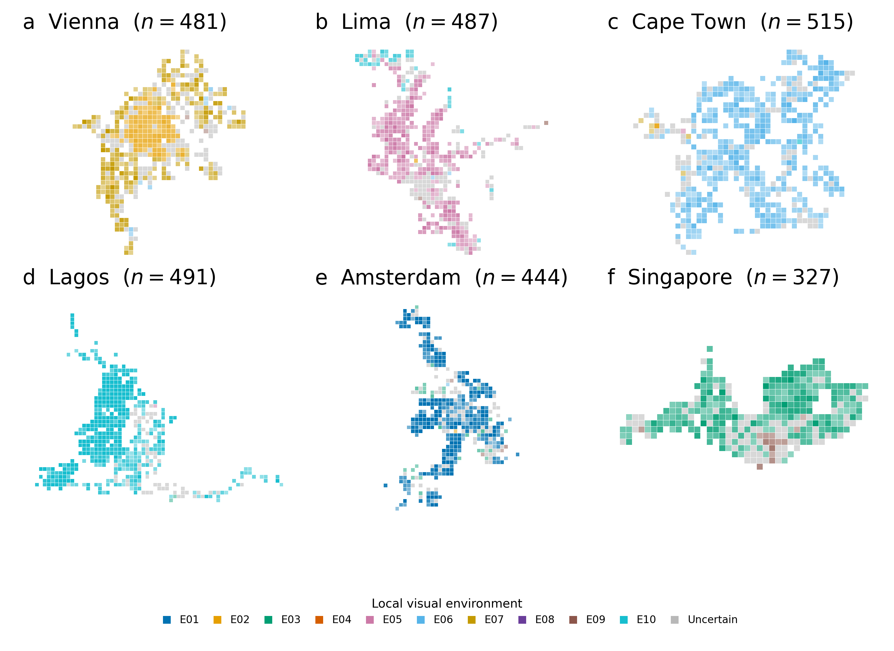

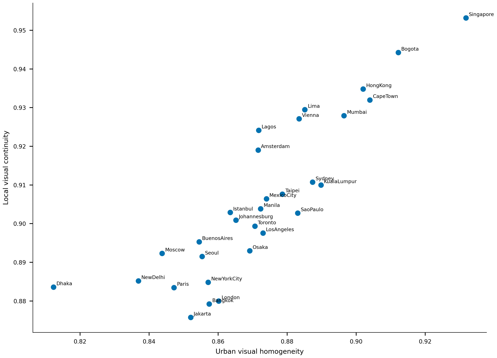

### 5. 可解释性来自多重证据，而不是单一 feature label

高激活图像和 overlay 显示，部分 latent 对植被、建筑立面、步行表面、道路垃圾、围栏和高密度建筑组合等视觉内容具有局部响应。与此同时，也存在冗余、位置相关、不稳定和图像质量相关的 latent。

因此论文将 related latent groups 作为 visual genes，而不是把每个 latent index 直接等同于一个稳定语义。独立训练、激活上下文、跨城市分布、外部 urban-form 关联和 post-hoc semantic interpretation 共同构成解释证据。

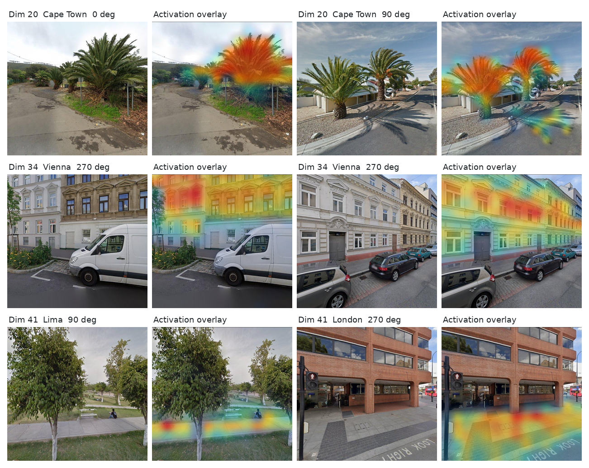

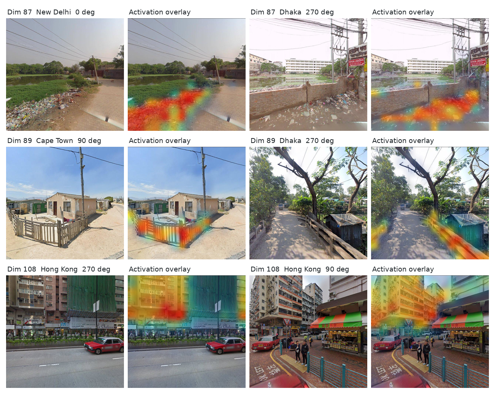

### 6. 稳健性和外部有效性

- 25%、50% 和 75% 的 subsampling 保留了主要的城市 composition、相似度和 co-occurrence 结构。
- 不同训练运行可能改变 latent 的编号和局部身份，但更高层的 feature families 和城市级组织保持较强一致性。
- building-related 分析保留了与建筑环境变化相关的 ordinal information，但 spatially blocked quantitative prediction 仍然有限。
- city classification 结果表明表征包含地理信息，但这种信号也可能受到采集时间、季节、图像质量和平台差异影响，因此必须结合 nuisance analysis 解读。

## 后续字典规模补充实验

仓库中另完成了一个固定评估集上的 scaling analysis。该结果用于研究“字典变大后哪些 feature 稳定、哪些 feature 被细分”，尚未写入论文 Chapter 5 正文。

- 模型：`W=512/1024/2048`，均为 BatchTopK `k=8`。
- 评估集：同一缓存中的固定 `100,000` 个 patch，固定随机 seed 和 batch 顺序。
- 匹配依据：decoder cosine similarity + 高激活 patch overlap。
- `W=512 -> W=1024`：249 个严格一对一稳定匹配，139 个 split candidates。
- `W=1024 -> W=2048`：436 个严格一对一稳定匹配，199 个 split candidates。

这里的 split candidate 指一个小字典 feature 对应多个大字典 feature，且多个子 feature 的高激活样本合计覆盖父 feature 的高激活样本。它是候选关系，不等同于已经完成的人工语义确认；最终确认还需要检查原始图像 activation maps、子 feature 的空间分化和组合重构误差。

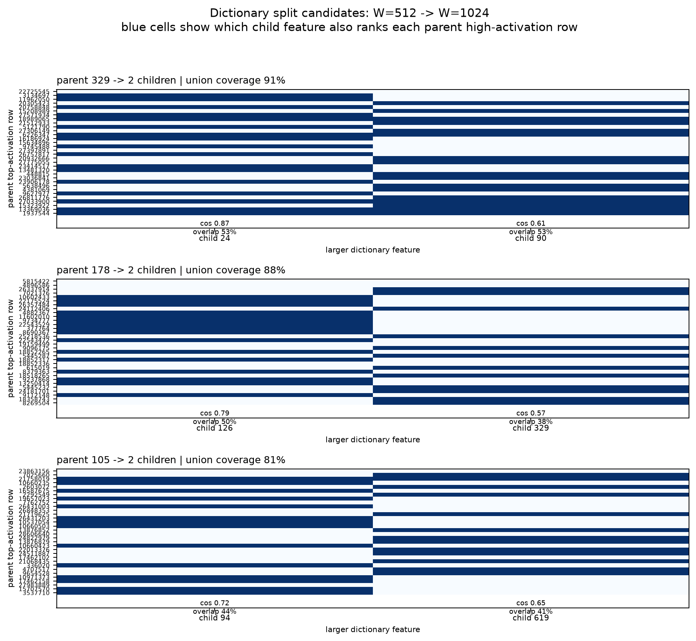

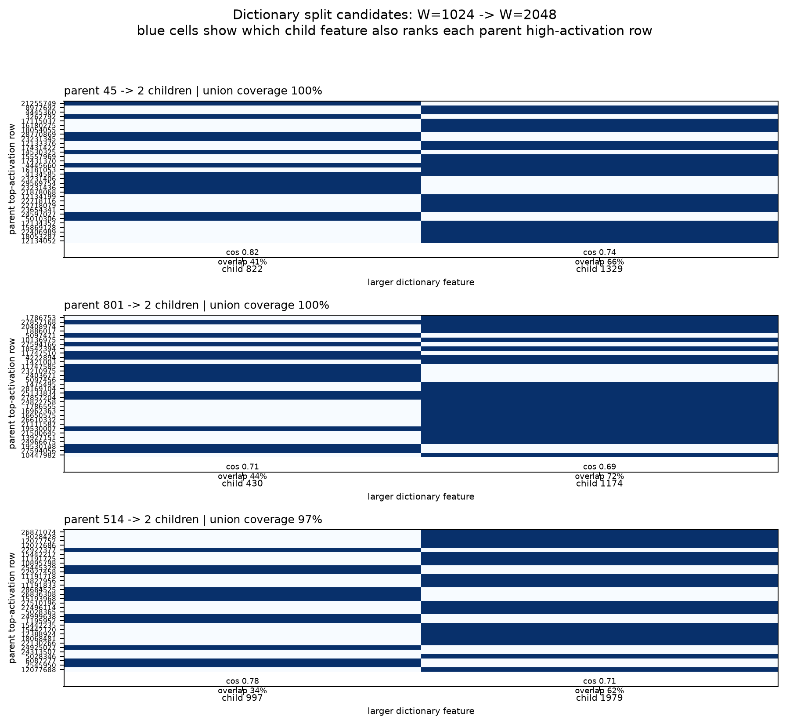

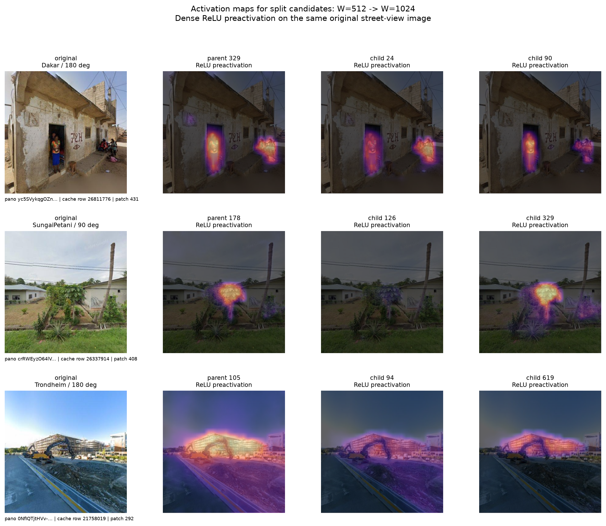

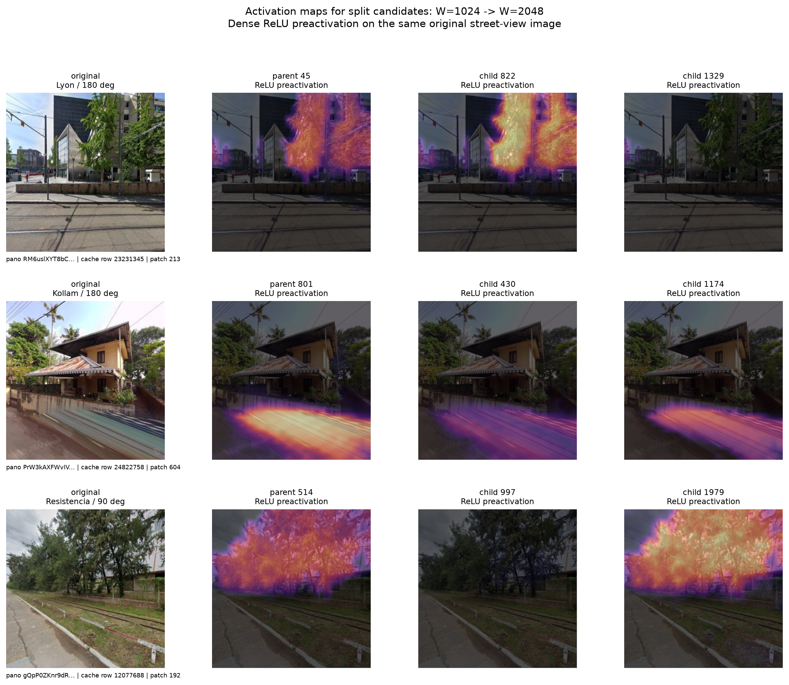

## 论文结论

Chapter 5 支持以下结论：

1. BatchTopK SAE 可以把高维 DINOv3 街景 patch 表征组织成可分析的稀疏视觉词汇。
2. 跨城市街景主要共享一套视觉模式，城市差异表现为共享模式的比例、组合和空间组织差异。
3. visual gene 的地理意义是相对的，取决于比较的城市集合和空间尺度；增加城市后，某个 pattern 的“shared”或“distinctive”属性可能变化。
4. visual gene 的解释应建立在稳定性、激活图像、地理分布、外部有效性和 nuisance sensitivity 的综合证据上，而不是单个 feature 的自动命名上。

## 需要在论文中保持谨慎的地方

- 30 城市样本是全球街景数据的一个选择性子集，不能直接等同于全球城市视觉结构。
- 论文中的“shared gene”依赖明确阈值，数量和组成会随阈值与参考城市集合变化。
- 当前 semantic interpretation 主要是 post-hoc pilot，仍需要 held-out positive/negative 对照和人工盲评。
- building prediction 的空间阻塞预测能力有限，当前证据更支持 ordinal association，而不是强预测结论。
- 当前 scaling analysis 使用固定 top-activation overlap 阈值，后续应进行阈值敏感性和多次随机初始化检验。

## 相关结果文件

- 论文原文：`/root/code/HKUST-Thesis/05_research3.tex`
- 字典规模汇总：`/host/root/mnt/nas/huangyj/GoogleSV/urban_visual_gene/formal_batchtopk_307city_scaling_analysis_100k/scaling_summary.json`
- 规模匹配结果：`matches_w512_to_w1024.csv`、`matches_w1024_to_w2048.csv`
- 细分候选激活图：`activation_maps_w512_w1024.png`、`activation_maps_w1024_w2048.png`
